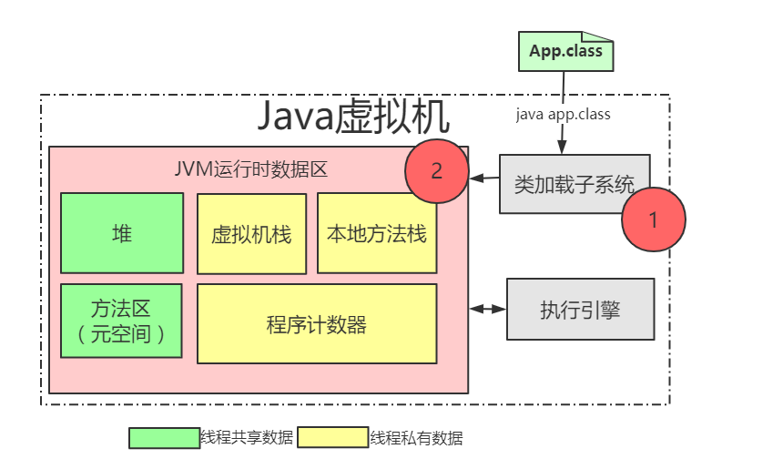

+ ++本地方法栈(线程私有)++：登记native方法，在Execution Engine执行时加载本地方法库。

+ ++程序计数器（线程私有）++：就是一个指针，指向方法区中的方法字节码（用来存储指向下一条指令的地址,也即将要执行的指令代码），由执行引擎读取下一条指令，是一个非常小的内存空间，几乎可以忽略不记。

+ ++方法区(线程共享)++：类的所有字段和方法字节码，以及一些特殊方法如构造函数，接口代码也在此定义。简单说，所有定义的方法的信息都保存在该区域，静态变量+常量+类信息(构造方法/接口定义)+运行时常量池都存在方法区中，虽然Java虚拟机规范把方法区描述为堆的一个逻辑部分，但是它却有一个别名叫做 Non-Heap（非堆），目的应该是与 Java 堆区分开来。

+ ++Java（虚拟）栈（线程私有）++： Java线程执行方法的内存模型，一个线程对应一个栈，每个方法在执行的同时都会创建一个栈帧（用于存储局部变量表，操作数栈，动态链接，方法出口等信息）不存在垃圾回收问题，只要线程一结束该栈就释放，生命周期和线程一致

  + 局部变量表

    存储局部变量值。

  + 操作数栈

    存储参与运算的局部变量的值。

  + 动态链接

  + 方法出口

    返回方法栈帧执行完毕的结果。
