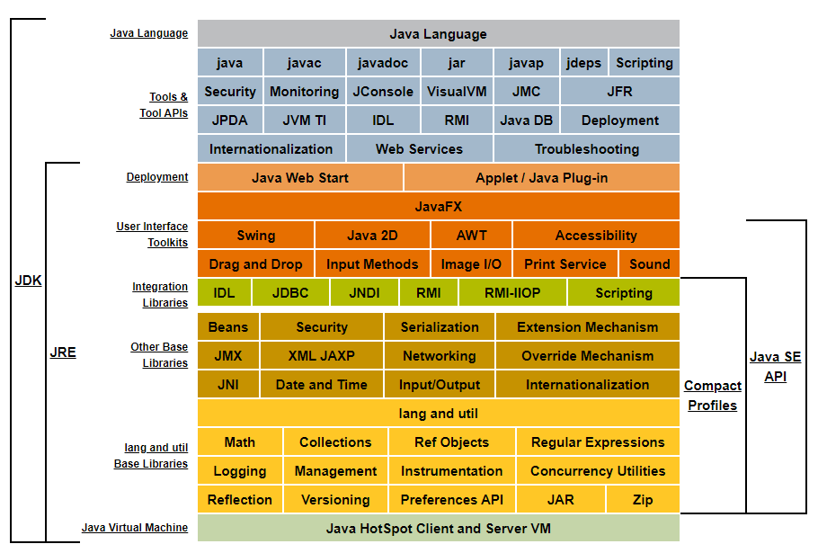

# Java与JVM整体认知

目标：

+ 理解从编写代码到编译成字节码再到解释执行最后程序退出资源释放的流程，
+ 理解JVM在Java中所处的位置，内部工作原理。


## Java开发入门流程

### 安装JDK

JDK的结构：



JDK = Java语言 + 开发工具/工具API + JRE ( Deployment + JavaSE API[类库] + JVM)

重点关注：

+ **JDK**

  + **Java Language**

  + **Tools & Tool APIs**

    + java

    + javac

    + javadoc

    + jar

    + javap

    + JConsole

    + VisualVM

    + JPDA

      Java程序调试的基础。

    + JVM TI

    + RMI

  + **JRE**

    + Deployment

      加载并运行网络应用相关。

      Java Web Start 基本没听过，但是它的一个名为JNLP的组成协议倒是经常听到（常见于网络安全漏洞报告）; Applet已经被淘汰了。

    + **Java SE API**

      + User Interface Toolkits

        都是用于开发桌面应用(图形界面应用)的。

      + Integration Libraries

        用于集成第三方实现库的接口。

      + Other Base Libraries

      + Lang and util Base Libraries

    + **JVM**

      + HotSpot

查看本地安装的JDK版本、JRE版本、JVM版本和运行模式：

```
$ java -version
openjdk version "1.8.0-292"
OpenJDK Runtime Environment (build 1.8.0-292-b10)
# JVM有Server和Client两种模式，64位机器必定是Server模式；使用动态编译执行与动态解释执行混合模式
OpenJDK 64-Bit Server VM (build 25.71-b10, mixed mode)
```


### 编写代码

略。


### 代码编译

这里主要指Java的前端编译，由javac完成，将.java文件编译成.class字节码文件。

关于javac编译原理参考《java_compile_theory/Java编译原理.md》

关于字节码文件的结构参考 《jvm_class_load/JVM class文件.md》。

> 有些文档写的很粗略，可能还有错误，但是后面会随着学习深入不断完善的。


### 代码执行

启动JVM进程，加载并执行.class文件（执行模式包括：执行jar文件、执行.class文件）。

**HotSpot JVM架构**：


JVM 主要由三大部分组成： 类加载子系统 + 运行时数据区 + 执行引擎。

#### 类加载子系统

参考 jvm_class_load。

#### 运行时数据区

参考 jvm_memory_manage。

#### 执行引擎

参考 jvm_execution_engine。

执行引擎主要分为：解释器、JIT编译器、垃圾回收器。

##### 解释器

##### JIT编译器

JVM执行代码时有两种模式：动态解释执行与动态编译执行（JIT）。

像C/C++是静态编译执行。动态解释执行节约内存，但是需要临时编译，执行效率低；动态编译则占内存，但是执行效率高（里面还附带一些JIT优化）。

只执行一次（只被调用一次且没有循环）的代码适合使用动态解释执行；热点代码适合动态编译执行。

经过类加载子系统的对class的加载、验证、准备、解析、初始化；程序代码对象已经放入运行时数据区；执行引擎从运行时数据区取方法和对象等进行执行，执行时会区分是否是热点代码（两种方式：**基于采样的热点探测**、**基于计数器的热点探测**），然后选择动态解释执行或动态编译执行。

HotSpot采用基于计数器的热点探测，它为每个方法准备了两个计数器: 方法调用计数器 和 回边计数器 。在确定虚拟机运行参数的前提下,这两个计数器都有一个确定的阈值,当计数器超过阈值溢出了,就会触发JIT编译。

参考:  java_compile_theory/Java编译原理.md。

##### 垃圾回收器

参考: java_memory_manage/3-JVM垃圾回收-GC.md。