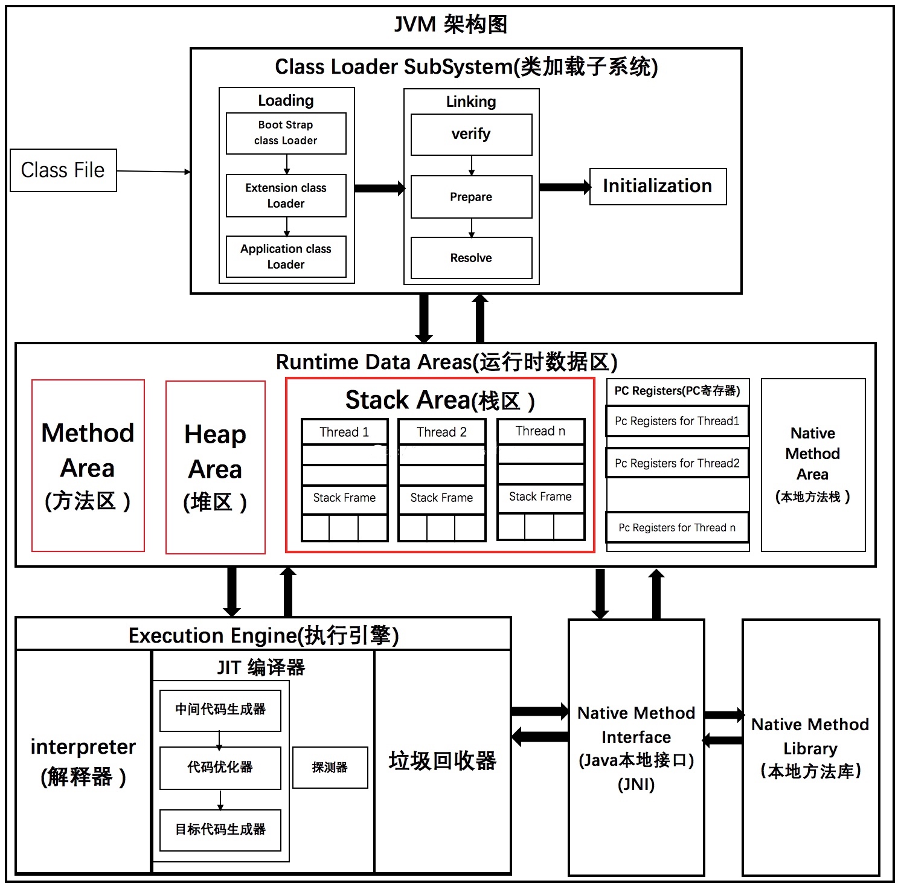

# Java与JVM整体认知

从编写代码到编译成字节码再到解释执行，弄清楚JVM在Java中所处的位置。

## 首先下载JDK，编写代码

  JDK = 编译器等开发工具 + JRE（运行类库 + JVM）

## 使用javac编译器将代码编译成字节码文件，打包成jar包

## java启动虚拟机执行jar包

### 查看当前JDK版本、JRE版本、JVM类型和运行模式
  ```
  $ java -version
  openjdk version "1.8.0_222"
  OpenJDK Runtime Environment (build 1.8.0_222-8u222-b10-1ubuntu1~18.04.1-b10)
  # JVM有Server和Client两种模式，64位机器必定是Server模式,使用动态编译执行与动态解释执行混合模式
  OpenJDK 64-Bit Server VM (build 25.222-b10, mixed mode)
  ```

### JVM用于加载class文件并执行

JVM = 类加载器 + 运行时数据区 + 执行引擎



前面已经完成java源码文件编译成class字节码文件；

下面JVM可以通过获取本地字节码文件或者通过网络获取远程字节码文件（Applet）进行后续操作。

> 包括： 加载 -> 验证 -> 准备 -> 解析 -> 初始化 -> 执行 -> 卸载 。  
> 前４步由JVM类加载子系统完成；  
> 第５步由运行类加载子系统为程序向运行时数据区分配；  
> 后２步由执行引擎完成，需要从运行时数据区交换执行数据或清除数据；

#### 类加载子系统

参考：《JVM类加载执行.md》

#### 运行时数据区

参考：《JVM运行时数据区.md》

#### 执行引擎

JVM执行代码时有两种模式：动态解释执行与动态编译执行（JIT）。  
像C/C++是静态编译执行。动态解释执行节约内存，但是需要临时编译，执行效率低；动态编译则占内存，但是执行效率高（里面还附带一些JIT优化）。

只执行一次（只被调用一次且没有循环）的代码适合使用动态解释执行；热点代码适合动态编译执行。

经过类加载子系统的对class的加载、验证、准备、解析、初始化；程序代码对象已经放入运行时数据区；执行引擎从运行时数据区取方法和对象等进行执行，执行时会区分是否是热点代码（两种方式：**基于采样的热点探测**、**基于计数器的热点探测**），然后选择动态解释执行或动态编译执行。

HotSpot采用基于计数器的热点探测，它为每个方法准备了两个计
数器: 方法调用计数器 和 回边计数器 。在确定虚拟机运行参数的前提下,这两个计数器都有一个确定的阈值,当计数器超过阈值溢出了,就会触发JIT编译。

阈值设置
```sh
-XX:CompileThreshold  #JVM Server模式使用JIT C2 默认10000.
```

方法调用计数器：  
针对方法调用。

回边计数器：  
针对循环体。  

如果方法是热点代码会去运行时数据区的方法区取编译好的本地代码。


疑问：
经过JIT编译的代码存放在方法区，那未经过JIT编译的字节码代码放在哪里？
JIT编译后的代码是什么？是机器码么？

##### JIT动态编译

更多参考：《深入理解Java虚拟机》chapter11。

JIT即时编译器分为Client Complier和Server Complier,简称为C1、C2编译器,分别用在客户端和服务端。现在基本都是Server Complier。

用Client Complier获取更高的编译速度,用Server Complier 来获取更好的编译质量。为什么提供多个即时编译器与为什么提供多个垃圾收集器类似,都是为了适应不同的应用场景。

JIT优化措施：

+ **公共子表达式消除**

  为了防止返回结果必定相同的子表达式重复执行。分为局部公共子表达式消除和全局公共子表达式消除。

  ```java
  int d = (c*b)*12+a+(a+b*c);
  //可能经历下面过程优化
  int d = E*12+a+(a+E);
  int d = E*13+a*2;
  ```

+ **数组边界检查消除**

+ **方法内联**

  将方法调用直接使用方法体中的代码进行替换,它减少了方法调用过程中压栈与入栈的开销,同时为之后的一些优化手段提供条件。
  ```java
  private int add4(int x1, int x2, int x3, int x4) {
    return add2(x1, x2) + add2(x3, x4);
  }
  private int add2(int x1, int x2) {
    return x1 + x2;
  }
  //被优化为
  private int add4(int x1, int x2, int x3, int x4) {
    return x1 + x2 + x3 + x4;
  }
  ```
  
+ **逃逸分析(不是优化，而是后面三种优化的前提)**

  逃逸分析(Escape Analysis)是动态分析对象作用域的分析算法。
  如果某个对象在某个区块被创建，作用域始终在这个区块中，则没有逃逸；如果对象作用于此区块之外，则发生逃逸。

  逃逸分析包括:  
  １）全局变量赋值逃逸  
  ２）方法返回值逃逸  
  ３）实例引用发生逃逸   
  ４）线程逃逸:赋值给类变量或可以在其他线程中访问的实例变量  

  开关逃逸分析：
  ```
  -XX:+DoEscapeAnalysis : 表示开启逃逸分析
  -XX:-DoEscapeAnalysis : 表示关闭逃逸分析
  ```
  举例：
  ```java
  public class EscapeAnalysis {
    //全局变量
    public static Object object;

    public void globalVariableEscape(){//全局变量赋值逃逸
      object = new Object();
    }

    public Object methodEscape(){
      //方法返回值逃逸
      return new Object();
    }

    public void instancePassEscape(){ 
      //实例引用发生逃逸
      this.speak(this);
    }
    public void speak(EscapeAnalysis escapeAnalysis){
      System.out.println("Escape Hello");
    }
  }
  ```

+ **对象的栈上内存分配**

  对象分配流程：

  

  如果对象始终作用于某个区块内部，就像局部变量一样，则可以将此对象内存分配放到栈上。随着栈空间一起创建和消亡，好处是避免参与GC回收，降低系统内存回收的压力。

  >  没有逃逸的对象虽说先尝试在栈上分配，但是当栈空间不足的时候，还是会在堆上进行分配。
  >
  > TLAB，全称Thread Local Allocation Buffer, 即：线程本地分配缓存。这是一块线程专用的内存分配区域。TLAB占用的是eden区的空间。在TLAB启用的情况下（默认开启），JVM会为每一个线程分配一块TLAB区域。
  >
  > 这是为了加速对象的分配。由于对象一般分配在堆上，而堆是线程共用的，因此可能会有多个线程在堆上申请空间，而每一次的对象分配都必须线程同步，会使分配的效率下降。考虑到对象分配几乎是Java中最常用的操作，因此JVM使用了TLAB这样的线程专有区域来避免多线程冲突，提高对象分配的效率。

  需要开启：  
  ```sh
  -XX:+DoEscapeAnalysis
  #还可以添加下面参数查看内存回收情况
  -XX:+PrintGCDetails
  ```

  ```java
  public class EscapeAnalysisTest {
    public static void main(String[] args) {
      long a1 = System.currentTimeMillis();
      for (int i = 0; i < 1000000; i++) {
        alloc();
      }
      // 查看执行时间
      long a2 = System.currentTimeMillis();
      System.out.println("cost " + (a2 - a1) + " ms");
      // 为了方便查看堆内存中对象个数，线程sleep
      try {
        Thread.sleep(100000);
      } catch (InterruptedException e1) {
        e1.printStackTrace();
      }
    }
  
    private static void alloc() {
      User user = new User();
    }
  
    static class User {
    }
  }
  ```

  ```
  jmap -histo <pid>   #查看堆内存对象实例情况
  ```

  疑问：为何存储在栈上的对象，实例数是８万多，而不是０？栈内存怎么回收的？

+ **标量替换**

  标量(Scalar) 是指一个无法再分解成更小的数据的数据。
  
  在JIT阶段,如果经过逃逸分析,发现一个对象不会被外界访问的话,那么经过JIT优化,就会把这个对象拆解成若干个其中包含的若干个成员变量来代替。

  ```java
  //有一个类A
  public class A{
    public int a=1;
    public int b=2
  }
  //方法getAB使用类A里面的a,b
  private void getAB(){
    A x = new A();
    x.a;
    x.b;
  }
  //JVM在编译的时候会直接编译成
  private void getAB(){
    a = 1;
    b = 2;
  }
  //这就是标量替换
  ```

+ **同步锁消除**

  同样基于逃逸分析,当加锁的变量不会发生逃逸,是线程私有的完全没有必要加锁。 在JIT编译时期就可以将同步锁去掉,以减少加锁与解锁造成的资源开销。

  需要开启
  ```sh
  -XX:+DoEscapeAnalysis -XX:+EliminateLocks
  ```

  ```java
  public class TestLockEliminate {
    public static String getString(String s1, String s2) {
      //StringBuffer内部有加synchronized
      //但sb没有逃逸
      StringBuffer sb = new StringBuffer();
      sb.append(s1);  //append()不会加synchronized
      sb.append(s2);
      return sb.toString();
    }

    public static void main(String[] args) {
      long tsStart = System.currentTimeMillis();
      for (int i = 0; i < 100000000; i++) {
        getString("TestLockEliminate ", "Suffix");
      }
      System.out.println("一共耗费：" + (System.currentTimeMillis() - tsStart) + " ms");
      //System.gc();
    }
  }
  ```

