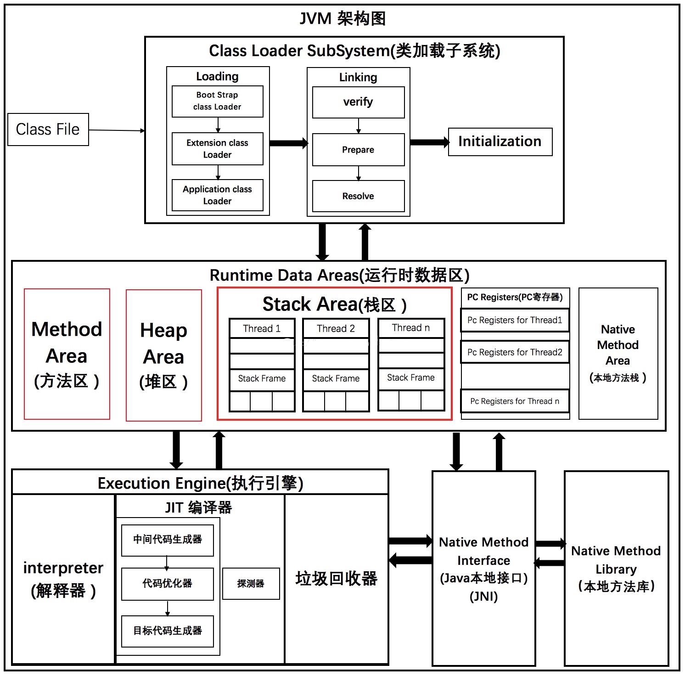
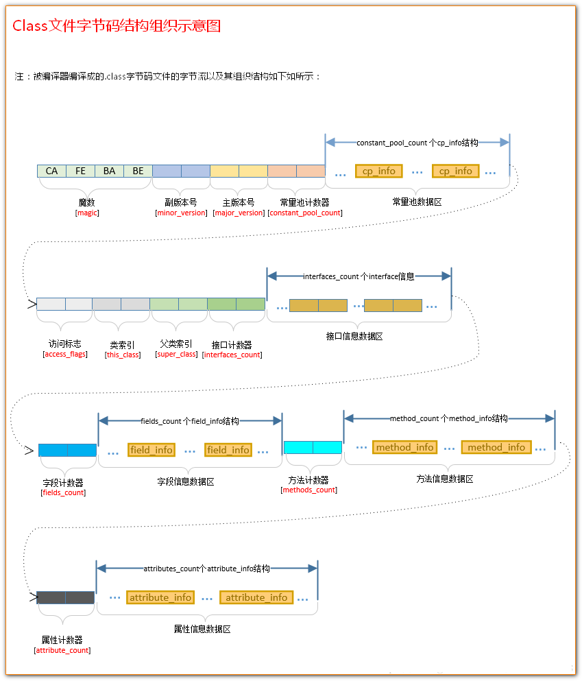
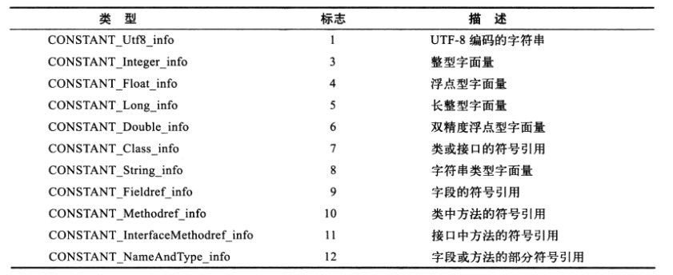
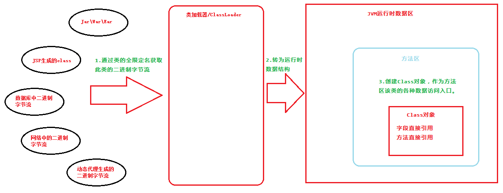
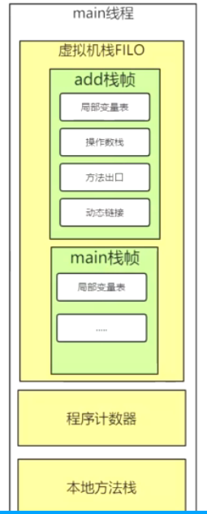

# JVM class文件与类加载执行

目标：

+ class文件是怎样的结构？怎么存储类信息的？
  + class文件常量池数据区都存哪些数据？和运行时常量池的关系？
+ JVM什么时候加载class？怎么加载到运行时数据区的？

JVM架构：





## class文件结构



### class中常量池数据区的存储结构

**类中哪些数据会被存储到常量池**（这里的常量池指**静态常量池**）：



所有引用类型(前５种)和部分值类型(后６种)存储在常量池。  

> 这里只讨论哪些值类型会存储到常量池：
>
> + final修饰的8种基本类型的引用和值；
> + 非final修饰(包括static)的long、double、float三种基本类型的值；
> + 字符串类型字面量（双引号引起来的字符串值）。
>
> private int aInt = 38; 而这种写法，38是存在class方法信息数据区的。

测试：`top.kwseeker.jvm.classloader.constpool.ConstPoolTest`

javap查看常量池信息：`javap -v ConstPoolTest`

**class常量池数据区存储结构**：

常量池计数器(N) + (N-1)个cp_info结构，cp_info针对不同类型常量有不同的存储结构。

第０个常量空出来是为了满足某些指向常量池的索引值的数据在特定的情况下表达“不引用任何一个常量池项”。

> + int、float final常量存储结构  
>   值类型：u1 tag（表示字面量类型，int是３，float是４）+ u4 info  
>
> + long、double常量存储结构  
>   值类型：u1 tag + u4高位字节 + u4低位字节  
>
>   这个结构解释了long和double的读写为何不是原子性的。
>
> + String类型字符串常量存储结构  
>   引用类型：u1 tag(值为8) + u2 String索引
>
>   值类型（全局常量池）：u1 tag(值为1) + u2 utf-8编码长度 + 字符串转utf-8后编码  
>
>   每个类都有一个常量池，而String的值类型是存储在全局常量池的。
>
> + Class类型
>
>   引用类型：u1 tag（值为７） + u2 name索引(二进制完全限定名)
>
>   Class还有个特殊的常量存储在常量池：u1 tag(值为１) + u2 转换后class路径utf-8编码长度 + utf-8编码（比如`top.kwseeker.jvm.classloader.constpool.ConstPoolTest`这个utf-8编码）。
>
>   值是存储在堆，某细特殊的存储在栈。

### class符号引用和直接引用

符号引用以一组符号来描述所引用的目标,符号可以是任何形式的字面量,只要使用时能够无歧义的定
位到目标即可。在Java中,一个java类将会编译成一个class文件。在编译时,java类并不知道所引用的类的实际地
址,因此只能使用符号引用来代替。

> 例如,在Class文件中它以 CONSTANT_Class_info、CONSTANT_Fieldref_info、
> CONSTANT_Methodref_info 等类型的常量出现。

直接引用可以是:
+ 直接指向目标的指针(比如,指向“类型”【Class对象】、类变量、类方法的直接引用可能是指
  向方法区的指针)

+ 相对偏移量(比如,指向实例变量、实例方法的直接引用都是偏移量)

+ 一个能间接定位到目标的句柄。

> 直接引用是和虚拟机的布局相关的,同一个符号引用在不同的虚拟机实例上翻译出来的直接引用
> 一般不会相同。如果有了直接引用,那引用的目标必定已经被加载入内存中了。

符号引用替换为直接引用的操作发生在 类加载过程 (加载 -> 连接(验证、准备、解析) -> 初始化)中
的**解析阶段**,会将符号引用转换(替换)为对应的直接引用,放入运行时常量池中。

### class中特殊字符串

+ 类全限定名

  如：`java/lang/Object`

+ 描述符

  + 基本数据类型 (byte、char、double、float、int、long、short、boolean):除 long boolean,其他基本数据类型的描述符用对应单词的大写首字母表示。 long 用 J 表示, boolean 用 Z 表示 。

  + void :描述符是 V。

  + 对象类型 :描述符用字符 L 加上对象的全限定名表示,如 String 类型的描述符为Ljava/lang/String 。

  + 数组类型 :每增加一个维度则在对应的字段描述符前增加一个[ ,如一维数组 int[] 的描述符为 [I ,二维数组 String[][] 的描述符为 [[Ljava/lang/String 。

+ 特殊方法的方法名

  `(参数1类型 参数2类型 参数3类型 ...)返回值类型`

  

## 类加载流程

### 类加载时机

《Java虚拟机规范》中并没有对“什么时候加载”进行强制约束，这点可以交给虚拟机的具体实现来自由把握。但是严格规范了“什么时候必须初始化”。而且加载一定是在初始化之前完成的。所以可以通过下面的初始化时机，推断出什么时候类一定是加载完成了的。

类初始化时机：

+ **遇到new、getstatic、putstatic、invokestatic这四条指令时，如果对应的类没有初始化，则要对对应的类先进行初始化**。

  即创建对象或者读写类的静态成员或调用类的静态方法时。

  + new 指令

    ```java
    User user = new User();
    ```

  + getstatic putstatic

    ```java
    public class User {
        //静态成员
        public static int age;
        //静态方法
        public static void method() {
        }
    }
    //读写静态成员变量
    int age = User.age;
    User.age = 25;
    ```

  + invokestatic

    ```java
    //调用静态方法
    User.method();
    ```

+ **使用`java.lang.reflect`包方法对类进行反射调用的时候**。

+ **初始化一个类而父类还未初始化的情况下则需要先触发其父类的初始化**。

+ **JVM启动时被标记为启动类的类会被先初始化**。

+ **JDK1.7中动态语言的支持，解析java.lang.invoke.MethodHandle的结果为REF_getStatic, REF_putStatic, REF_invokeStatic方法的句柄时，对应的类没有初始化的时候**。

+ **当一个接口中定义了JDK 8新加入的默认方法（被default关键字修饰的接口方法）时，如果有这个接口的实现类发生了初始化，那该接口要在其之前被初始化**。

写一个简单的demo，怎么查看加载了标准库中的哪些类？

可以使用 `-XX:+TraceClassLoading` 查看类加载日志。

### 类加载源



### 类加载流程

#### 加载（class信息加载到方法区）

１）通过一个类的全限定名来获取定义此类的二进制字节流(class文件)；

２）将这个字节流的静态存储结构转化为方法区的运行时数据结构；

３）在内存中创建一个该类的java.lang.Class对象 ,作为方法区该类的各种数据的访问入口。

##### 类和数组加载区别

数组类和非数组类的类加载是不同的,具体情况如下:

+ 非数组类: 是由类加载器来完成。
+ 数组类: 数组类本身不通过类加载器创建,它是由 java 虚拟机直接创建,但数组类与类加载器有
  很密切的关系,因为数组类的元素类型最终要靠类加载器创建。

#### 链接（3个步骤）

##### 验证

保证二进制字节流中的信息符合虚拟机规范,并没有安全问题。

+ 文件格式验证
+ 元数据验证
+ 字节码验证
+ 符号引用验证

##### 准备

<u>仅仅为类变量(即static修饰的字段变量)分配内存并且设置该类变量的初始值即零值</u>,这里不包含用
final修饰的static,因为final在编译的时候就会分配了(编译器的优化),同时这里也不会为实例
变量分配初始化。 类变量会分配在方法区中,而实例变量是会随着对象一起分配到Java堆中 。

准备阶段主要完成两件事情:

+ 为已在方法区中的类的静态成员变量分配内存
+ 为静态成员变量设置初始值,初始值为0、false、null等

> public static int x = 1000;
>
> 实际上变量x在准备阶段过后的初始值为0,而不是1000；
> 将x赋值为1000的putstatic指令是程序被编译后,存放于类构造器<clinit>方法之中。
>
> <init>是对象构造方法，<clinit>是类构造方法。
>
> 但添加final修饰的话：public static final int x = 1000;
>
> 在编译阶段会为x生成ConstantValue属性,在准备阶段虚拟机会根据ConstantValue属性将x赋值为
> 1000。

##### 解析

<u>解析是虚拟机将常量池的 符号引用替换为直接引用的过程 。</u>
解析动作主要针对类或接口、字段、类方法、接口方法四类符号引用进行,分别对应于常量池中的
CONSTANT_Class_info 、 CONSTANT_Fieldref_info 、 CONSTANT_Methodref_info 、
`CONSTANT_InterfaceMethodref_info`四种常量类型。

+ 类或接口的解析
+ 字段解析
+ 类方法解析
+ 接口方法解析

#### 初始化

调用类初始化方法的过程,完成对static修饰的类变量的手动赋值还有主动调用静态代码块。

方法是编译器自动收集 类中所有类变量的赋值动作和静态语句块中的语句合并产生 的,编译器收
集的顺序是由语句在源文件中出现的顺序所决定的.

##### 初始化过程注意点

静态初始化代码块是线程安全的（JVM会加锁串行操作），非静态初始化代码块呢？

#### 使用

#### 卸载

当全部满足下面三个条件时，会卸载类（**原理也是可达性分析**，即切断对Class对象的所有引用则会卸载类）。

1、该类所有的实例都已经被回收，也就是java堆中不存在该类的任何实例。
2、加载该类的ClassLoader已经被回收。
3、该类对应的java.lang.Class对象没有任何地方被引用，无法在任何地方通过反射访问该类的方法（Class对象root不可达）（除了上面两种引用方式，还有可能在业务逻辑也存在引用，所以这个条件也必须满足）。

`类的实例对象 --(引用)-> 类的Class对象 <-(双向引用)->  ClassLoader(对象)`

`还需要注意程序员写的业务逻辑也可能存在对类的Class对象的引用`

>类加载器的内部实现中，用一个Java集合来存放所加载类的引用。

由Java虚拟机自带的类加载器所加载的类，在虚拟机的生命周期中，始终不会被卸载。

因为JVM自身所带的类加载器在虚拟机生命周期中始终存在，由上面的引用模型可知这些类的Class对象永远可达不可以释放。

## 详细分析

### 编译

Java源文件编译成java字节码文件
    
```
javac -help
javac App.java
javap -help
javap -v -p App.class > App.txt
```

```java
package top.kwseeker.jvm.debug;

public class App {

    public int add() {
        int a = 1;
        int b = 2;
        int c = (a + b) * 100;
        return c;
    }

    public static void main(String[] args) {
        App app = new App();
        int result = app.add();
        System.out.println(result);
    }
}

```

字节码指令

关于学习字节码有什么用？可以了解ASM，javassist，cglib的实现。
在不想重新编译的前提下修改代码就需要理解应该怎么直接修改字节码文件。

class文件以文本格式打开的话显示的是16进制代码。

关于javap生成人可读的字节码文件(16进制文件生成下面格式文件)的规则，
参考: [深入理解JVM之Java字节码（.class）文件详解](https://windysha.github.io/2018/01/18/%E6%B7%B1%E5%85%A5%E7%90%86%E8%A7%A3JVM%E4%B9%8BJava%E5%AD%97%E8%8A%82%E7%A0%81%EF%BC%88-class%EF%BC%89%E6%96%87%E4%BB%B6%E8%AF%A6%E8%A7%A3/)

```C
Classfile /home/lee/mywork/java/java-base/jvm-principle/jvm-debug-demo/src/main/java/top/kwseeker/jvm/debug/App.class
  Last modified 2020-1-12; size 510 bytes
  MD5 checksum ae03eeb9a704f02cbcb27450e67ba158
  Compiled from "App.java"
public class top.kwseeker.jvm.debug.App
  //反编译并没有显示魔术，魔数是固定的表示这是字节码文件
  //主版本号
  minor version: 0                
  //副版本号      
  major version: 52                     
  //访问标志，详细参考文档：https://docs.oracle.com/javase/specs/jvms/se8/html/jvms-4.html#jvms-4.1-200-E.1
  //表示当前Class为public类型，允许使用invokespecial字节码指令的新语义
  flags: ACC_PUBLIC, ACC_SUPER    
//常量池（代码组成部分的列表），存储类的元数据
//包括文字字符串， 常量值， 当前类的类名， 字段名， 方法名， 各个字段和方法的描述符， 对当前类的字段和方法的引用信息， 当前类中对其他类的引用信息等等
Constant pool:   
  //#N=？中"？"是常量类型,右边是值
  //1号常量是Methodref，说明值是一个方法，
  //这里值表示把7号常量和18号常量用"."连接起来，是Object的无参构造方法             
  #1 = Methodref          #7.#18         // java/lang/Object."<init>":()V
  //表示19号常量是一个类
  #2 = Class              #19            // top/kwseeker/jvm/debug/App
  #3 = Methodref          #2.#18         // top/kwseeker/jvm/debug/App."<init>":()V
  #4 = Methodref          #2.#20         // top/kwseeker/jvm/debug/App.add:()I
  //表示java/lang/System.out:Ljava/io/PrintStream是一个类的成员变量
  #5 = Fieldref           #21.#22        // java/lang/System.out:Ljava/io/PrintStream;
  #6 = Methodref          #23.#24        // java/io/PrintStream.println:(I)V
  #7 = Class              #25            // java/lang/Object
  //构造方法
  #8 = Utf8               <init>
  //方法无返回值
  #9 = Utf8               ()V
  //方法体，看下面详解
  #10 = Utf8               Code
  //LineNumberTable用于存储源码行数和方法内指令对应关系，用于调试（看下面详解）
  #11 = Utf8               LineNumberTable
  #12 = Utf8               add
  //方法返回int类型
  #13 = Utf8               ()I
  //main方法
  #14 = Utf8               main
  //值表示方法入参为String[],无返回值
  //For example, the class name representing the two-dimensional array type int[][] is [[I, while the class name representing the type Thread[] is [Ljava/lang/Thread;.
  #15 = Utf8               ([Ljava/lang/String;)V
  #16 = Utf8               SourceFile
  #17 = Utf8               App.java
  //方法名和入参出参
  #18 = NameAndType        #8:#9          // "<init>":()V
  #19 = Utf8               top/kwseeker/jvm/debug/App
  #20 = NameAndType        #12:#13        // add:()I
  #21 = Class              #26            // java/lang/System
  #22 = NameAndType        #27:#28        // out:Ljava/io/PrintStream;
  #23 = Class              #29            // java/io/PrintStream
  #24 = NameAndType        #30:#31        // println:(I)V
  #25 = Utf8               java/lang/Object
  #26 = Utf8               java/lang/System
  #27 = Utf8               out
  #28 = Utf8               Ljava/io/PrintStream;
  #29 = Utf8               java/io/PrintStream
  #30 = Utf8               println
  #31 = Utf8               (I)V
//方法
{
  public top.kwseeker.jvm.debug.App();
    descriptor: ()V
    flags: ACC_PUBLIC
    //方法代码块
    Code:
      //最大操作数栈，局部变量所需存储空间，方法参数个数（每个方法默认有一个隐藏的this参数）
      stack=1, locals=1, args_size=1
        0: aload_0
        1: invokespecial #1                  // Method java/lang/Object."<init>":()V
        4: return
      //源码第3行对应这里第0行（对应aload_0指令）
      LineNumberTable:
        line 3: 0

  public int add();
    descriptor: ()I
    flags: ACC_PUBLIC
    Code:
      stack=2, locals=4, args_size=1
        0: iconst_1
        1: istore_1
        2: iconst_2
        3: istore_2
        4: iload_1
        5: iload_2
        6: iadd
        7: bipush        100
        9: imul
        10: istore_3
        11: iload_3
        12: ireturn
      LineNumberTable:
        line 6: 0
        line 7: 2
        line 8: 4
        line 9: 11

  public static void main(java.lang.String[]);
    descriptor: ([Ljava/lang/String;)V
    flags: ACC_PUBLIC, ACC_STATIC
    Code:
      stack=2, locals=3, args_size=1
        0: new           #2                  // class top/kwseeker/jvm/debug/App
        3: dup
        4: invokespecial #3                  // Method "<init>":()V
        7: astore_1
        8: aload_1
        9: invokevirtual #4                  // Method add:()I
        12: istore_2
        13: getstatic     #5                  // Field java/lang/System.out:Ljava/io/PrintStream;
        16: iload_2
        17: invokevirtual #6                  // Method java/io/PrintStream.println:(I)V
        20: return
      LineNumberTable:
        line 13: 0
        line 14: 8
        line 15: 13
        line 16: 20
}
SourceFile: "App.java"
```

> 字节码指令不一定是原子操作。

### 加载

类加载原理参考《类加载机制.md》

这里需要弄明白的几点：类何时被触发加载？类加载都做了什么？如何实现自定义的类加载器？

**类加载触发时机**：

Java 类的加载,使用了“延迟加载”机制,仅在第一次被使用时才会发生真正的加载。
JVM启动期间会预先加载一部分核心类库。
用户自定义的类何时首次被使用比较容易界定，但是rt.jar和ext/*.jar中的类首次使用估计要看main类加载流程了。

可以使用 -XX:+TraceClassLoading 查看类加载日志。

**类加载流程**：

1) 通过类的全限定名来获取定义此类的二进制字节流（class）；  
    这个二进制流并不一定要从class文件获取，还可以从网络获取(Applet)，从zip/Jar/War/Ear获取，
    运行时计算生成（动态代理），从其他文件生成（JSP）等。  
    通过双亲委派机制最终调用native defineClass0/1/2() 方法完整真正的类加载操作。
    至于defineClass到底干了什么就需要看JVM源码了。
2) 将字节流所代表的静态存储结构转化为方法区的运行时数据结构；  
    即将class文件中内容存储到JVM运行时数据区。
    每个线程都拥有自己的虚拟机栈、本地方法栈和程序计数器。

​    

3) 在内存中生成一个代表这个类的java.lang.Class对象，作为方法区这个类的各种数据的访问入口。 

数组类的加载不是通过类加载器而是JVM直接创建。

加载阶段完成后虚拟机外部二进制字节流就按照虚拟机所需的格式存储在方法区之中，
方法区中的数据存储格式由虚拟机实现自行定义，虚拟机规范未规定此区域的具体数据结构。
然后在内存中实例化一个java.lang.Class类对象，这个对象将作为程序访问方法区中这些类型数据的外部接口。

**补充**：

类加载后的Class实例并不是类实例instanceKlass本身而是类镜像实例，Class估计是为了实现反射才出现的。

Java8之后类的静态字段（static成员）从instanceKlass迁移到了Class。

### 验证

验证加载阶段获得的二进制字节流.class文件是否符合jvm规范。

a) 文件格式验证  
b) 元数据验证  
c) 字节码验证  
d) 符号引用验证  

### 准备

准备阶段主要是给static变量分配内存(方法区中)，并设置初始值。

```
//准备阶段只将值设置为零值，在初始化阶段才将值设置为123
//因为准备阶段还未执行任何方法，将值设置为123的putstatic指令是在类构造器<clinit>()方法中
//而类构造方法在初始化时执行。
public static int value = 123；
//下面这种写法在准备阶段直接将值设置为123
//编译时将为value生成ConstantValue属性，在准备阶段虚拟机根据这个属性将value赋值为123
public static final int value = 123；
```
上面说的编译又是在哪个阶段？  
加载之前，通过编译生成class文件。

### 解析

虚拟机将常量池内的符号引用替换为直接引用。

解析阶段就更抽象了，稍微说一下，因为不太重要，有两个概念，符号引用，直接引用。说的通俗一点但是不太准确，比如在类A中调用了new B();大家想一想,我们编译完成.class文件后其实这种对应关系还是存在的，只是以字节码指令的形式存在，比如 "invokespecial #2" 大家可以猜到#2其实就是我们的类B了，那么在执行这一行代码的时候，JVM咋知道#2对应的指令在哪,这就是一个静态的家伙，假如类B已经加载到方法区了，地址为(#f00123),所以这个时候就要把这个#2转成这个地址(#f00123),这样JVM在执行到这时不就知道B类在哪了，就去调用了。(说的这么通俗，我都怀疑人生了).其他的，像方法的符号引用，常量的符号引用，其实都是一个意思，大家要明白，所谓的方法，常量，类，都是高级语言(Java)层面的概念，在.class文件中，它才不管你是啥，都是以指令的形式存在,所以要把那种引用关系(谁调用谁，谁引用谁)都转换为地址指令的形式。好了。说的够通俗了。大家凑合理解吧。这块其实不太重要，对于大部分coder来说，所以我就通俗的讲了讲。

### 初始化

根据程序中的赋值语句主动为类变量赋值。

这一块其实就是调用类的构造方法,注意是类的构造方法，不是实例构造函数，实例构造函数就是我们通常写的构造方法，类的构造方法是自动生成的，生成规则:
static变量的赋值操作、static代码块 按照出现的先后顺序来组装。

> 注意:
> 1) static变量的内存分配和初始化是在准备阶段.
> 2) 一个类可以是很多个线程同时并发执行，JVM会加锁保证单一性，所以不要在static代码块中搞一些耗时操作。避免线程阻塞。

> ++如果类还未初始化需要初始化的情况（注意区分Class的初始化和对象的初始化）++：  
> 1.使用new该类实例化对象的时候  
> 2.读取或设置类静态字段的时候（但被final修饰的字段，在编译器时就被放入常量池的静态字段除外static final）  
> 3.调用类静态方法的时候  
> 4.使用反射Class.forName(“xxxx”)对类进行反射调用的时候，该类需要初始化  
> 5.初始化一个类的时候，有父类，先初始化父类（注：1. 接口除外，父接口在调用的时候才会被初始化；2.子类引用父类静态字段，只会引发父类初始化）  
> 6.被标明为启动类的类（即包含main()方法的类）要初始化  
> 7.当使用JDK1.7的动态语言支持时，如果一个java.invoke.MethodHandle实例最后的解析结果 REF_getStatic、REF_putStatic、REF_invokeStatic的方法句柄，并且这个方法句柄所对应的类没有进行过初始化，则需要先触发其初始化

> 初始化顺序：    
> 1. 父类的静态变量和静态块赋值（按照声明顺序）  
> 2. 自身的静态变量和静态块赋值（按照声明顺序）  
> 3. 父类成员变量和块赋值（按照声明顺序）  
> 4. 父类构造器赋值  
>    如果父类中包含有参构造器，却没有无参构造器，则在子类构造器中一定要使用“super(参数)”指定调用父类的有参构造器，不然就会报错  
> 5. 自身成员变量和块赋值（按照声明顺序）  
> 6. 自身构造器赋值  

### 使用

比如：某个线程，执行嵌套调用方法，包含哪些存储空间（本地方法栈、程序计数器、虚拟机栈（栈帧（局部变量表、操作数栈、方法出口、动态链接））、堆、方法区），变量的值是怎么在各个存储空间流转的。

### 卸载

