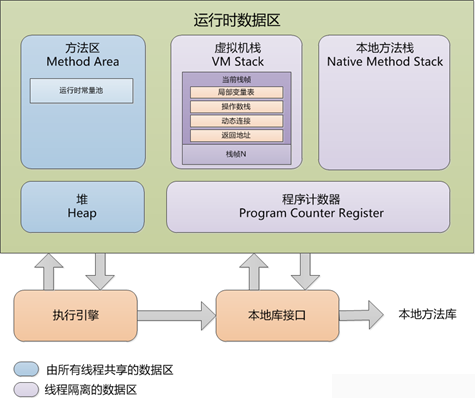

目标：

+ 理解方法区中存储的都是哪些内容
+ 理解方法区、永久代、元空间的关系和区别
+ 理解哪些原因导致方法区出现异常
+ 理解字符串常量池存储哪些内容，在JVM内存的哪个区域
+ 理解字符串常量池是怎么存储字符串数据的
+ 理解JVM设置字符串常量池的好处
+ 掌握字符串常量池的案例分析方法
+ 理解String的intern方法的作用和它的好处
+ 掌握字符串常量池和String#intern方法的案例分析方法
+ 理解Java堆的内存包含哪些部分
+ 理解Java堆的内存分配原则
+ 理解Java堆内存分配方式和如何保证内存分配的线程安全
+ 理解Java堆中对象创建的步骤和Java对象在堆中的布局
+ 理解Java堆中对象和数组的访问方式

## JVM运行时数据区结构

JVM运行时数据区分成两大类:

+ 线程独享(不需要垃圾回收):虚拟机栈、本地方法栈、程序计数器
+ 线程共享(垃圾回收):堆和方法区

> JVM运行时数据区的使用顺序(结合程序运行原理分析):
>
> 1. 方法区(存类的元信息和静态变量):初始大小、最大大小。一般建议初始大小和最大大
>    小设置为一样,好处是减少内存自动扩容带来的性能损耗。
> 2. 栈&程序计数器&本地方法栈: 和线程有关。
> 3. 堆:初始大小、最大大小。
>    对象、数组

注意JDK1.8将方法区的实现称为“元空间”，之前是“永久代”；JDK1.8元空间是JVM运行时数据区之外的一块内存，JDK1.８之前是使用的Java进程的运行时数据区内部的一块内存（每个启动的Java进程都有一块运行时数据区）。

> Oracle收购Java后将JRockit和Hostpot设计融合了，优化了永久代为元空间，将部分数据挪到堆中，避免了永久代较小的内存被常量池占用完导致内存溢出的问题。

!!!　JDK1.8元空间只是存储类的元信息，而静态变量和运行时常量池都挪入了堆中。

同时注意区分方法区的“元空间/永久代”与堆内存的新生代、老年代的区别。

### 线程共享区域

#### 方法区

存储内容：虚拟机已加载的类信息 + 运行时常量池(class常量池数据区的内容都会存储到这里)。

感觉JDK1.８之前，class中大部分内容都存在了方法区，可以先分析堆、本地方法区、JVM虚拟机栈、程序计数器里面都存什么，剩下的都放方法区。

JDK1.8之后，方法区只放类元数据（类型信息、字段信息、方法信息、方法表）；

##### 方法区OOM异常的原因分析

JDK1.8 报`java.lang.OutOfMemoryError: metadata space`

调整元空间大小的JVM参数：`-XX:MetaspaceSize=40m -XX:MaxMetaspaceSize=40m`

调整堆空间大小的JVM参数：`-Xmx -Xms -XX:MaxHeapSize=128m`

> -XX:MinMetaspaceFreeRatio
> 在GC之后,最小的Metaspace剩余空间容量的百分比,减少为分配空间所导致的垃圾收集
> -XX:MaxMetaspaceFreeRatio
> 在GC之后,最大的Metaspace剩余空间容量的百分比,减少为释放空间所导致的垃圾收集

+ 类加载导致

  编码异常导致不断地new ClassLoader，并加载类。

  典型场景是jsp文件很多的时候很容器造成方法区OOM。

+ 字符串导致

  不断创建新的字符串常量。
  
  JDK1.8将字符串常量移入堆空间，不再消耗方法区空间。

#### 堆

##### 内存划分

###### 字符串常量池

按类似hashtable（数组＋链表）的方式存储字符串对象。

> JVM对字符串常量的处理：
>
> 1、单独使用””引号创建的字符串都是常量,编译期就已经确定存储到String Pool中。
> 2、使用new String(“”)创建的对象会存储到heap中,是运行期新创建的对象。
> 3、使用只包含常量的字符串连接符如”aa”+”bb”创建的也是常量,编译期就能确定已经存储到String
> Pool中。
> 4、使用包含变量的字符串连接如”aa”+s创建的对象是运行期才创建的,存储到heap中;
> 5、运行期调用String的intern()方法可以向String Pool中动态添加对象。
>
> String$intern()的作用
>
> intern()的作用是把new出来的字符串的引用添加到stringtable中,java会先计算string的hashcode,查
> 找stringtable中是否已经有string对应的引用了,如果有返回引用(地址),然后没有把字符串的地址
> 放到stringtable中,并返回字符串的引用(地址)。
>
> 但是对于JDK1.7前字符串常量池还没移到堆中时intern()却是不同的处理方式（涉及对象复制）。

###### 运行时常量池

###### 新生代(8:1:1)

Eden(伊甸园)：s0(from survivor):s1(to survivor) = 8:1:1  

###### 老年代(20)

##### 堆除了常量池以外的空间存储的数据类型

对象、数组。

##### 堆对象内存分配

查看Java进程堆内存分配`jmap -heap <PID>`

###### 内存分配规则

１）优先在 Eden 分配,如果 Eden 空间不足虚拟机则会进行一次 MinorGC
２）大对象直接接入老年代,大对象一般指的是很长的字符串或数组
３）长期存活的对象进入老年代,每个对象都有一个age,当age到达设定的年龄的时候就会进
入老年代,默认是15岁。

###### 内存分配方式

+ 指针碰撞
+ 空闲列表

###### 内存分配的线程安全保证

+ CAS

+ TLAB（Thread Local Allocation Buffer, 本地线程分配缓冲）

  为每一个线程预先分配一块内存 , JVM在给线程中的对象分配内存时,首先在TLAB分配,当对象大于TLAB中的剩余内存或TLAB的内存已用尽时,再采用上述的CAS进行内存分配。

###### 对象内存布局

###### 对象访问方式

+ 句柄

  引用指向句柄池中某个对象实例数据的句柄（存储包括对象实例数据和类型数据的指针），指针指向实例池中对象实例数据和类型数据。

  稳定，对象被移动只需要修改句柄中的地址。

+ 直接指针

  引用直接指向对象实例数据地址，实例数据中存储有指向对象类型数据的指针。

  访问速度快，节省了一次指针定位的开销。

##### 数组内存分析

一维数组内存结构：

二维数组内存结构：

##### class常量池、运行时常量池、字符串常量池的关系

每个类的class文件有一个class常量池数据区；class常量池中除了字符串常量放字符串常量池外的其他字面量都放运行时常量池。

每个类在JVM堆（1.8）有一个运行时常量池；

每个Java进程在JVM堆有一个字符串常量池（全局唯一）。

### 线程独享区域

#### Java虚拟栈

+ 每个方法执行时会创建一个栈帧；
+ 局部变量表用于存储方法参数和方法内局部变量，容量以变量槽计算，每个变量槽可以存放一个32位以内的数据类型；
+ 操作数栈，用于计算，从局部变量表中复制变量压入操作数栈然后交给ALU计算，ALU从操作数栈pop操作数进行计算将结果再压入操作数栈，计算结束将操作数栈的结果出栈到局部变量表或者返回给方法出口；
+ 动态连接，即运行期间将调用其他方法的符号引用转化为内存地址中的直接引用。
+ 返回地址，即当前方法执行完毕返回到上一层栈帧的执行位置。

#### 本地方法栈

针对处理native方法(C/C++)调用。

#### 程序计数器

+ ++本地方法栈(线程私有)++：登记native方法，在Execution Engine执行时加载本地方法库。

+ ++程序计数器（线程私有）++：就是一个指针，指向方法区中的方法字节码（用来存储指向下一条指令的地址,也即将要执行的指令代码），由执行引擎读取下一条指令，是一个非常小的内存空间，几乎可以忽略不记。

+ ++Java（虚拟）栈（线程私有）++： Java线程执行方法的内存模型，一个线程对应一个栈，每个方法在执行的同时都会创建一个栈帧（用于存储局部变量表，操作数栈，动态链接，方法出口等信息）不存在垃圾回收问题，只要线程一结束该栈就释放，生命周期和线程一致

  + 局部变量表

    存储局部变量值。

  + 操作数栈

    存储参与运算的局部变量的值。

  + 动态链接

  + 方法出口

    返回方法栈帧执行完毕的结果。

## OOM异常

除了程序计数器，其他内存区域都可能出现OOM异常。

