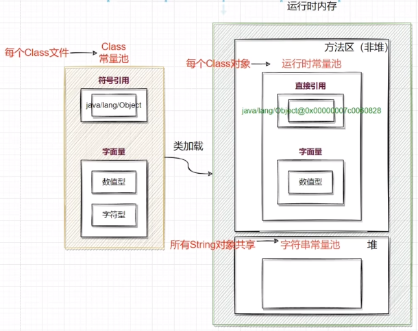
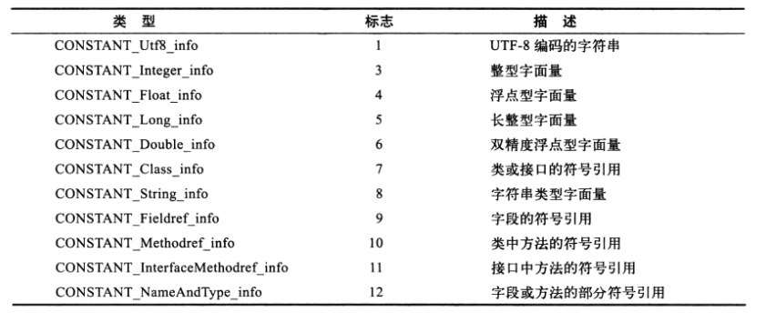

# 常量池

+ 静态常量池&运行时常量池&字符串常量池的区别

  

  Class文件的常量池称为**静态常量池**，存储符号引用、字面量（这部分网上总结的非常乱用词不严谨，所以这里还是以书上列举的为准）。
  
  符号引用以及数值型字面量经过类加载，存放在方法区（符号引用转成直接引用），字符型字面量存入堆。每个Class的运行时常量池都是独立的。字符串常量池对所有String对象是共享的。
  
  
  
  对应上面每个都给一个例子
  
  ```java
  //CONSTANT_Utf8_info
  private String str = "hello";	//这里的 "hello"
  private final byte bByte = 41;	//这里的 bByte
  //CONSTANT_Integer_info
  private final byte bByte = 41;	//这里的 41
  private final boolean bBoolean = false;	//这里的 false(0)
  //CONSTANT_Float_info
  private float aFloat = 37F;		//这里的 37F(37.0)
  //CONSTANT_Class_info
  private ReentrantLock lock = new ReentrantLock();	//这里引入的类的符号引用 java/util/concurrent/locks/ReentrantLock
  //CONSTANT_String_info
  private String str = "hello";	//这里的 "hello"
  //CONSTANT_Fieldref_info
  private boolean aBoolean = true;//aBoolean类字段与类型信息 top/kwseeker/jvm/classloader/constpool/ConstPoolTest.aBoolean:Z
  //CONSTANT_Methodref_info
  private ReentrantLock lock = new ReentrantLock(); //ReentrantLock()类方法与入参返回信息：java/util/concurrent/locks/ReentrantLock."<init>":()V
  //CONSTANT_NameAndType_info
  private final boolean bBoolean = false;	//这里aBoolean字段名和类型信息（Z指boolean类型） aBoolean:Z
  ```
  
  参考《JVM class文件与类加载执行.md》C1.1.1。
  
  

