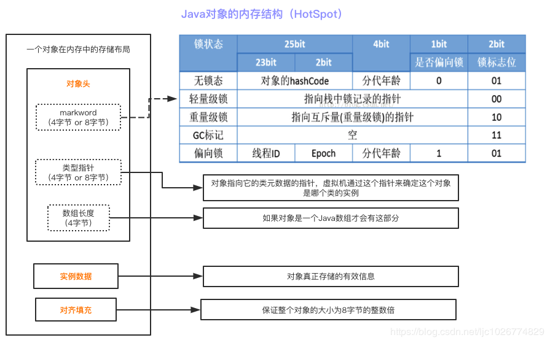

# JVM对象创建＆内存分配

目标：

+ JVM对象创建详细流程
+ 对象头与指针压缩
+ 对象内存分配详情
+ 逃逸分析＆栈上分配＆标量替换

## 流程图

流程参考java_exec_process.drawio 流程图。

## 类加载检查

虚拟机遇到一条new指令时，首先将去检查这个指令的参数是否能在常量池中定位到一个类的符号引用，并且检查这个
符号引用代表的类是否已被加载、解析和初始化过。如果没有，那必须先执行相应的类加载过程。
new指令对应到语言层面上讲是，new关键词、对象克隆、对象序列化等。

## 分配内存

对象所需内存的大小在类加载完成后便可完全确定。

**对象的内存结构：**

Java对象的表示模型叫做“OOP-Klass”二分模型。包括两部分:

+ OOP，即Ordinary Object Point，普通对象指针。表示对象的实例信息。Oop指针，如果系统是32G内存以下的，默认开启对象指针压缩，4个字节。

+ Klass，即Java类的C++对等体，用来描述Java类，**包含了元数据和方法信息**等，在类加载中生成存储在**方法区**。

Java对象内存结构分为下面三部分，对应二分模型中的OOP。

Markword: 32位系统占４字节，64位系统占用８字节。

**分配内存的方法：**

+ 指针碰撞（Bump the Pointer，默认使用方法）
+ 空闲列表（Free List）

择哪种分配方式由Java堆是否规整决定， 而Java堆是否规整又由所采用的垃圾收集器是否带有空间压缩整理（Compact） 的能力决定。 因此， 当使用Serial、 ParNew等带压缩整理过程的收集器时， 系统采用的分配算法是指针碰撞， 既简单又高效； 而当使用CMS这种基于清除（Sweep） 算法的收集器时， 理论上就只能采用较为复杂的空闲列表来分配内存。

**内存分配的并发问题解决方案：**

场景：在并发情况下也并不是线程安全的， 可能出现正在给对象A分配内存， 指针还没来得及修改， 对象B又同时使用了原来的指针来分配内存的情况。 

+ CAS 

  失败重试。

+ TLAB（Thread Local Allocation Buffer，本地线程分配缓冲）

  往线程在Java堆中预先分配的一小块内存中分配。

  ­-XX:+/-­UseTLAB

  -­XX:TLABSize 

如果TLAB放不下，就使用CAS方式分配。

## 对象初始化

## 设置对象头

## 执行`<init>`方法

## 参考

+ 《深入理解Java虚拟机》2.3 HotSpot虚拟机对象探秘

  