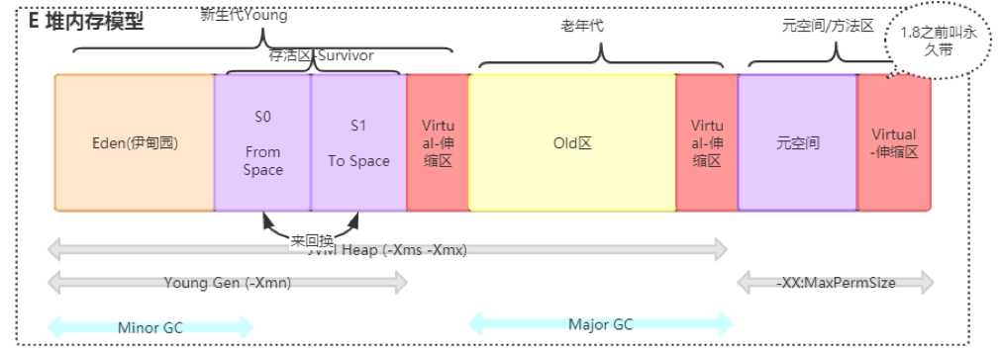
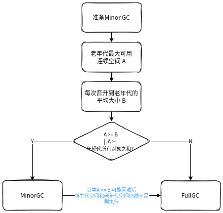

# JVM对象创建＆内存分配

目标：

+ JVM对象创建详细流程
+ 对象头与指针压缩
+ 对象内存分配详情
+ 逃逸分析＆栈上分配＆标量替换


## 流程图

流程参考java_exec_process.drawio 流程图。


## 类加载检查

虚拟机遇到一条new指令时，首先将去检查这个指令的参数是否能在常量池中定位到一个类的符号引用，并且检查这个
符号引用代表的类是否已被加载、解析和初始化过。如果没有，那必须先执行相应的类加载过程。
new指令对应到语言层面上讲是，new关键词、对象克隆、对象序列化等。


## 分配内存

对象所需内存的大小在类加载完成后便可完全确定。

### 对象的内存结构

Java对象的表示模型叫做“OOP-Klass”二分模型。包括两部分:

+ OOP，即Ordinary Object Point，普通对象指针。表示对象的实例信息。

  OOP，这个应该不只是指对象头中的类型指针（猜测，估计指的是所有对象指针）；如果系统是32G内存以下的，默认开启对象指针压缩，4个字节。

+ Klass，即Java类的C++对等体，用来描述Java类，**包含了元数据和方法信息**等，在类加载中生成存储在**方法区**。

> **这个OOP到底是什么？**上面只是猜测，查下资料，最好能看看HotSpot源码。发现指针压缩不仅仅发生在对象头的类型指针，还发生在实例数据中的对象指针上。
>
> **Klass和Class实例对象又是什么关系？**
>
> JVM通过对象头的类型指针获取Klass元数据信息；Class表示正在运行的Java应用程序中的类和接口，Class是Java提供给用户访问Klass元数据信息的工具。
>
> **对象指针压缩**：
>
> 使用压缩算法将64位地址压缩为32位地址，可以减少对象内存占用，以及数据传输时带宽占用，减轻GC压力；堆内存小于4G时，不需要启用指针压缩，jvm会直接去除高32位地址，即使用低虚拟地址空间；堆内存大于32G时，压缩指针会失效，会强制使用64位(即8字节)来对java对象寻址，所以堆内存不要大于32G为好。
>
> 指针压缩参数 -XX:+UseCompressedOops 默认开启。

Java对象内存结构分为下面三部分：


Markword: 32位系统占４字节，64位系统占用８字节。

类型指针(Klass Pointer)：开启压缩占4字节，关闭压缩占8字节。

> + **字节对齐**（8字节对齐）
>
>   因为底层硬件平台会要求访问时对齐（减少寻址指令周期），从而维护访问性能和正确性，这就希望字段按照大小对齐。
>
>   64位HotSpot VM每次读取数据的最小单位是**8字节**，因此对象大小必须保持8字节的整数倍，不足则填充。
>
>    JVM对其内部5中静态类型变量，oop、double、word、short和byte都有内存对齐的规则，oop引用类型按4字节对齐；double按8字节对齐；word按4字节；short按2字节，最后byte类型按1字节对齐。
>
> + **字段重排**
>
>   但是因为对齐可能会增加内存间隙（浪费内存），通过字段重排减少内存间隙；提升空间利用率。
>
>   （注：翻了几本书也没找到详细解释的，找到一篇网文[Java对象在内存中的布局是如何实现的](https://www.finclip.com/news/f/46724.html)，讲的相对比较清楚）
>
>   字段重排规则：主要受 -XX:FieldsAllocationStyle 和 -XX:CompactFields 影响。
>   
>   -XX:FieldsAllocationStyle 有3个可选值，即0、1、2。当值为2的时候，会经过一些逻辑判断最终转化为0或者1.
>   
>   -XX:FieldsAllocationStyle=0 表示先分配对象类型字段，然后再按照double/long、ints、chars/shorts、bytes/booleans的顺序分配其他字段，也就是类中声明的相同宽度的字段总是会被分配在一起，而相同宽度字段的顺序则是它们在class文件中声明的顺序。
>   
>   -XX:FieldsAllocationStyle=1 (默认策略) 表示先按照double/long、ints、chars/shorts、bytes/booleans的顺序分配字段，然后再分配对象类型字段，分配过程中的其他原则上面为0时是保持一致的。
>   
>   -XX:CompactFields表示是否将对象中较窄的数据插入到间隙中，-XX:+CompactFields表示插入，-XX:-CompactFields则是不插入。默认JVM是开启插入的。
>   
>   将对象中较窄数据的插入间隙，可以细分为2种情况:
>   
>   当前类没有父类或者是父类中没有实例数据，此时会将实例数据前的对象标记和对象元数据指针按照8字节对齐，在开启压缩指针的情况下，对齐前占用12个字节，对齐后到16字节，此时存在4个字节的间隙，那么会将类中存在的字段按照 ints、chars/shorts、bytes/booleans、oops的顺序进行填充，直到将间隙填充完毕，由于对齐之后的间隙要么是0，要么是4，所以填充间隙最多1个ints、2个chars/shorts、4个bytes/booleans、1个oops。
>   
>   当前类存在父类，并且父类中存在实例数据，此时会将实例数据前的对象标记和对象元数据指针 + 父类的实例数据大小按照8字节对齐，然后再进行填充，由于整个类在计算完所有字段偏移之后，会再与heapOopSize进行对齐，所以父类的实例数据大小肯定是heapOopSize的倍数，也就是与第一种情况类似，不同的是，子类中的字段属性需要在父类字段之后进行分配。

### 分配内存的方法

+ 指针碰撞（Bump the Pointer，默认使用方法）
+ 空闲列表（Free List）

选择哪种分配方式由Java堆是否规整决定， 而Java堆是否规整又由所采用的垃圾收集器是否带有空间压缩整理（Compact） 的能力决定。 因此， 当使用Serial、 ParNew等带压缩整理过程的收集器时， 系统采用的分配算法是指针碰撞， 既简单又高效； 而当使用CMS这种基于清除（Sweep） 算法的收集器时， 理论上就只能采用较为复杂的空闲列表来分配内存。

**内存分配的并发问题解决方案：**

场景：在并发情况下也并不是线程安全的， 可能出现正在给对象A分配内存， 指针还没来得及修改， 对象B又同时使用了原来的指针来分配内存的情况。 

+ CAS 

  失败重试。

+ TLAB（Thread Local Allocation Buffer，本地线程分配缓冲）

  往线程在**Java堆**（注意还是在堆中分配）中预先分配的一小块内存中分配，是线程私有的。

  ­-XX:+/-­UseTLAB

  -­XX:TLABSize 

如果TLAB放不下，就使用CAS方式分配。

### 内存分配流程

参考java_exec_process.drawio流程图。

依次经历：栈上分配（对于没有逃逸的对象） -> 大对象直接进入老年代 -> TLAB空间分配（减低内存分配时的并发竞争，提升效率） -> Eden -> Old。 

#### 内存分配相关优化

+ **对象逃逸分析**

  *详细参考《深入理解Java虚拟机》P11.4.3。*

  逃逸分析(Escape Analysis)是动态分析对象作用域的分析算法。若一个对象在方法中被定义后可以被其他方法引用到或被其他线程访问到，则发生逃逸。

  JDK后默认开启，-XX:+DoEscapeAnalysis。

  发生逃逸行为的情况有两种：方法逃逸和线程逃逸。

  + 方法逃逸：当一个对象在方法中定义之后，作为参数传递到其它方法中，return到上层方法中。
  + 线程逃逸：当一个对象在方法中定义之后，赋值给类变量或实例变量。

  如果不存在逃逸行为，则可以对该对象进行如下优化：**同步消除**、**标量替换**和**栈上分配**。

+ **栈上分配**

  > 经测试：
  >
  > 开启逃逸分析但是关闭标量替换后无论如何都会将对象分配到堆上。
  >
  > 有下面说法：
  >
  > HotSpot虚拟机只是开启逃逸分析并未使用栈上分配，也就是说栈上还是只能存基本类型数据或者引用，对象还是在堆上分配，除非使用了标量替换。可能是为了防止栈上分配的对象过多导致栈溢出。

+ **标量替换**

  通过逃逸分析确定该对象不会被外部访问，并且对象可以被进一步分解时，JVM不会创建该对象，而是将该
  对象成员变量分解若干个被这个方法使用的成员变量所代替，这些代替的成员变量在栈帧或寄存器上分配空间，这样就
  不会因为没有一大块连续空间导致对象内存不够分配。开启标量替换参数(-XX:+EliminateAllocations)，JDK7之后默认
  开启。
  
  > 标量与聚合量：标量即不可被进一步分解的量，而JAVA的基本数据类型就是标量（如：int，long等**基本数据类型**以及
  > **reference类型**等），标量的对立就是可以被进一步分解的量，而这种量称之为聚合量。

+ **锁消除**

  没有逃逸的对象和局部变量一样是线程安全的，没必要加锁，加锁反而会带来额外浪费，编译器会移除该对象的同步锁。JDK8默认是开启锁消除的 -XX:+EliminateLocks。

#### 内存分配详情



**对象在Eden区的分配：**

大多数情况下，对象在新生代中 Eden 区分配。当 Eden 区没有足够空间进行分配时，虚拟机将发起一次Minor GC。

Minor GC/Young GC：指发生新生代的的垃圾收集动作，Minor GC非常频繁，回收速度一般也比较快。
Major GC/Old GC：清理老年代，Major GC的速度一般会比Minor GC的慢10倍以上。目前只有 CMS 垃圾收集器会有单独的收集老年代的行为。
Full GC：一般会回收老年代 ，年轻代，方法区的垃圾。同时最糟糕的是 Full GC 为了枚举 GC Roots 不得不 stop the world（STW）。JVM 目前来说最大的缺点一方面是占用内存较多，另一方面就是这个 STW 了。

Eden与Survivor区默认8:1:1，JVM默认有这个参数-XX:+UseAdaptiveSizePolicy(默认开启)，会导致这个8:1:1比例自动变化，如果不想这个比例有变化可以设置参数-XX:-UseAdaptiveSizePolicy。

> 经测试（ObjectAllocOnHeapTest.java）eden:from:to:parOldGen 默认并不是想象中严格的 8:1:1:20，本以为是因为+UseAdaptiveSizePolicy(默认开启)修改了，但是关闭此参数还是一样？！！是-XX:+PrintGCDetails 空间计算不准取么？

**大对象直接在老年代分配：**

注意这个大对象并不是内存占用大于Eden空间的对象，而是内存占用大于 -XX:PretenureSizeThreshold 参数指定值（单位字节）的对象。如果对象超过此参数设置大小会直接进入老年代，不会进入年轻代，这个参数只在 Serial 和ParNew两个收集器下有效。

默认使用的GC收集器是 Parallel Scanvenge 和 Parallel old。-XX:+PrintFlagsFinal 可以看到：

```txt
     bool UseParallelGC                            := true                                {product}
     bool UseParallelOldGC                          = true                                {product}
```

大对象一般是需要大量连续内存空间的对象（比如：字符串、数组、容器类）。

为了避免为大对象分配内存时的复制操作而降低效率，比如长期存活的占内存接近from/to区空间大小的很容易造成频繁的内存复制，但是可能增加FullGC次数。

> 生产环境如何协调分配各个空间大小，以及设置JVM各个参数？参考调优章节。

**对象年龄&长期存活对象移入老年代：**

年龄阈值JVM参数：-XX:MaxTenuringThreshold。默认为15岁，CMS收集器默认6岁，不同的垃圾收集器会略微有点不同。

**对象动态年龄判断：**（不一定非要等到15岁，才移入老年代）

为了节省年轻代空间，希望那些可能是长期存活的对象，尽早进入老年代。所有有这么个动态年龄判断机制。

当from区一批对象的总大小大于这块区域内存大小的50%(-XX:TargetSurvivorRatio 指定)，那么此时大于等于这批对象年龄最大值的对象，就可以直接移入老年代了。比如年龄1+年龄2+年龄n的多个年龄对象总和超过了Survivor区域的50%，此时就会把**年龄n(含)**以上的对象都放入老年代。

**老年代空间分配担保机制：**

对比借贷担保，老年代空间担保机制是说为新生代担保，当新生代空间不够存储对象，就直接在老年代中分配空间存储。

> 可进入老年代的对象包括：
>
> 1 占用空间大于 -XX:PretenureSizeThreshold 值的对象；
>
> 2 放不下Eden区的对象（注意区分和大对象的区别）；
>
> 3 放不下Survivor的Eden区存活的对象；
>
> 4 from区动态年龄判断符合直接进入老年代的对象。

JDK8的老年代空间担保机制实现：



**年轻代每次minor gc之前JVM都会计算下老年代最大连续可用空间（A）；和之前每次晋升到老年代的平均大小(B)**

如果这个可用空间大于A或大于B，直接执行MinorGC；否则执行FullGC。

A >= B的情况，可能存在这次实际晋升的对象空间B'大于老年代可用空间A，就会再触发一次FullGC。对老年代和年轻代一起回收一次垃圾；

如果经过FullGC后还是没有足够空间存放新的对象就会发生"OOM"。

>  -XX:-HandlePromotionFailure 在JDK6 Update24之后就不再影响担保机制了。

## 对象初始化

内存分配完成后，虚拟机需要将分配到的内存空间都初始化为零值（不包括对象头）。

初始化零值的内存空间是不是就是实例数据空间、对齐填充的空间需要初始化零值么？


## 设置对象头

设置这个对象是哪个类的实例、 如何才能找到类的元数据信息、 对象的哈希码、 对象的GC分代年龄等信息。


## 执行`<init>`方法

执行类的构造方法。


## 参考

+ 《深入理解Java虚拟机》2.3 HotSpot虚拟机对象探秘

+ 《实战Java虚拟机：JVM故障诊断与性能优化》
+ 《揭秘Java虚拟机 JVM设计原理与实现》