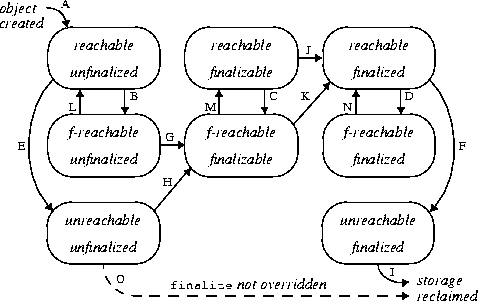

# JVM垃圾回收

目标：

+ 何时触发GC？是针对JVM哪个内存分区的？
+ 对象回收机制
  + 对象存活判定算法
  + 可达性分析算法
    + GC ROOT
    + 引用类型
+ 类回收机制

+ JVM垃圾收集器&垃圾收集算法


## Java对象生命周期

注意区分**Java类的生命周期**：加载（Loading）、验证（Verification）、准备（Preparation）、解析（Resolution）、初始化（Initialization）、使用（Using）和卸载（Unloading）。其中验证、准备、解析三个部分又统称为连接（Linking）。

**对象的生命周期**大致可以分为7个阶段：

+ **创建阶段**（Created）
+ **应用阶段**（Using）
+ **不可视阶段**（Invisible）
+ **不可达阶段**（Unreachable）
+ **可收集阶段**（Collected）
+ **终结阶段**（Finalized）
+ **对象空间重新分配**（Deallocated）


## GC流程

### 回收目标

GC是针对堆和方法区。

程序计数器、虚拟机栈、本地方法栈3个区域随线程而生，随线程而灭。

而Java堆和方法区则不一样，一个接口的多个实现类需要的内存可能不一样，一个方法中的多个分支需要的内存也可能不一样，我们只有在程序处于运行期间时才能知道会创建哪些对象，这部分内存的分配和回收都是动态的，垃圾收集器所关注的是这部分内存。

### GC触发时机

总结前面的内容可知，下面几种时机会触发GC:

+ 在Eden区没有足够的空间创建新对象时，触发YoungGC；
+ 老年代担保机制，老年代的使用率达到一定的阈值后，会触发Full GC（多次Youn GC存活的对象、符合动态年龄判断条件的对象、Eden存活对象但是survior区内存不足时的对象）；
+ YGC空间不足时会将对象存放进老年代，若老年代的空间也不够的话，也会触发Full GC（比如大对象进入老年代）;
+ 元空间空间不足时，也会触发Full GC。

### GC 存活判定方法

#### 引用计数法

实现简单，效率高，但是循环引用的问题无解。

#### 可达性分析算法

将“GC Roots” 对象作为起点，从这些节点开始向下搜索引用的对象，找到的对象都标记为非垃圾对象，其余未标记的对象都是垃圾对象。

GCRoot对象都是选用非堆内存中的对象，能作为根的都是些始祖（无法往上继续溯源）对象。

+ **虚拟机栈(栈帧中的局部变量表)中引用的对象**

+ **方法区中的类静态变量引用的对象**

+ **方法区中的常量引用的对象**

+ **本地方法栈（Native Method Stack）中 JNI 引用的对象**

  > JNI中引用的对象？代码体现出现是什么样的？

+ **Java虚拟机内部的引用， 如基本数据类型对应的Class对象， 一些常驻的异常对象（比如**
  **NullPointExcepiton、 OutOfMemoryError） 等， 还有系统类加载器**
+ **所有被同步锁（synchronized关键字） 持有的对象**
+ **反映Java虚拟机内部情况的JMXBean、 JVMTI中注册的回调、 本地代码缓存等**

> 上面内容来自《深入理解Java虚拟机》，但是感觉说法有误，GC Root 应该是对象引用（对象指针）而不是指向的对象（有些书籍说是对象指针）。

垃圾回收会触发**STW**(在获取根节点这步时会暂停用户线程)，虽然可达性分析算法耗时最长的查找引用链的过程已经可以做到和用户线程一起并发，但根节点枚举的获取还必须是要在一个能保证一致性的快照中才能进行。（应该就是类似并发加锁阻塞，收集垃圾对象的时候如果业务线程对象的引用关系还在变化，很可能出现错误）。

现在所有垃圾收集器（包括YoungGC收集器）都会触发STW。

##### 安全点 & 安全区域


##### 引用类型

并非没有GC Root引用链的的对象才会被GC回收。java的引用类型一般分为四种：强引用、软引用、弱引用、虚引用；

| 引用类型 | 被垃圾回收时机                                        | 用途               | 生存时间          |
| -------- | ----------------------------------------------------- | ------------------ | ----------------- |
| 强引用   | 只要是GC ROOT可达一直都不会被回收                     | 对象的一般状态     | JVM停止运行时终止 |
| 软引用   | 当内存不足时（不管是否可达）， 内存充足的时候不会回收 | 对象缓存           | 内存不足时终止    |
| 弱引用   | GC一看到立刻回收（不管是否可达）                      | 对象缓存           | 垃圾回收后终止    |
| 虚引用   | 随时随刻（不管是否可达）                              | 跟踪对象的垃圾回收 | 垃圾回收后终止    |

其中除了强引用，其他都可以在存在GC Root引用链的情况下被GC回收器回收。

使用案例：

+ **软引用**

  常用于内存敏感的高速缓存。

+ **弱引用**

  + WeakHashMap

+ **虚引用**

##### 不可达对象的二次标记

参考：《深入理解JVM》3.2.4

涉及Object类finalize()方法的使用。这个finalize()是给用户提供的用于调整GC回收措施的，对象在GC之前会被调用一次此方法且仅调用一次。

不可达对象的二次标记其实是针对重写finalize()方法而言的，如果finalize()没有被重写，则JVM认为就按默认的回收处理直接就回收了；如果重写之后，就需要重新判断对象是否可回收（万一用户在finalize()中重新引用了该对象呢？），具体流程：若对象未执行过finalize方法，将其放入F-Queue队列，由一低优先级线程执行该队列中对象的finalize方法。执行finalize方法完毕后，GC会再次判断该对象是否可达，若不可达，则进行回收，否则，对象“复活”,但是复活之后再次不可达之后会直接被回收。




### 无用类的回收

“无用的类”判断条件：

+ **该类所有的对象实例都已经被回收**

+ **加载该类的ClassLoader被回收**

  引导类加载器、拓展类加载器、应用程序类加载器在JVM运行过程中不会被回收; 所以由它们加载的类也不会被回收（大部分类都是由这三个类记载器加载的，所以大部分类都不会被回收）。

+ **该类对应的java.lang.class对象没有任何地方被引用**

> 为何说引导类加载器、拓展类加载器、应用程序类加载器在JVM运行过程中不会被回收？
>
> 可否理解为`private static final ClassLoader scloader = ClassLoader.getSystemClassLoader();`这里总是有个GC Root 引用着应用程序类加载器，而应用程序类加载器通过parent指针引用着拓展类加载器；至于引导类加载器是JNI引用的；所以都不会被回收。


## GC收集算法

### 四种回收算法

+ **复制算法**（内存使用率低）

  这种情况堆内存只有一半可用，每次回收将存活下来的对象拷贝到另一半空白空间，而将当前这半空间数据清空。

+ **标记清除**（清除效率低，容易产生碎片空间）

  先将可以回收的对象的地址空间全部标记起来，最后统一定点清除。

+ **标记整理**(清除效率低)

  可以理解为标记清除+整理，将垃圾对象清除之后，将存活对象全部移动到一端连续的内存里面。

+ **分代收集**（现在基本都采用此算法）

  即前面介绍的分代回收算法，综合使用了上面的回收算法，from和to区很明显就是复制算法。

### 如何手动触发GC回收

```java
//下面两种写法是完全一样的
System.gc()
Runtime.getRuntime().gc()
```


## GC收集器（怎么回收）

参考：《深入理解JVM》3.5垃圾收集器

年轻代和老年代垃圾收集器可搭配使用关系：


GC回收器是回收算法的具体的实现。


### 新生代垃圾收集器：

+ **Serial** （-XX:+UseSerialGC）

  垃圾收集方式：串行方式（单线程）

  回收算法：复制算法。

  会暂停所有工作线程，导致STW。

+ **Parallel Scanvenge** [并行回收] （-XX:+UseParallelGC）

  Serial的多线程版本，复制算法，仍然会引起STW。
  
  Java8默认新生代垃圾收集器。
  
  着重**提高CPU吞吐量**，吞吐量就是 CPU 中用于运行用户代码的时间与 CPU 总消耗时间的比值。Parallel Scavenge 收集器提供了很多参数供用户找到最合适的停顿时间或最大吞吐量。
  
  在注重吞吐量以及 CPU资源的场合，都可以优先考虑 Parallel Scavenge收集器和Parallel Old收集器。
  
  > **吞吐量**：单位时间内处理任务的数量（不关注每个任务的处理时间）；
  >
  > CMS等收集器更多的是关注用户线程的停顿时间（**响应速度**）。
  
+ **PartNew** （-XX:+UseParNewGc）

  ParNew收集器其实跟Parallel收集器很类似，区别主要在于它可以和CMS收集器配合使用。

  是许多运行在Server模式下的虚拟机的首要选择。

> 新生代垃圾收集器都是使用的复制算法，因为新生代垃圾回收很频繁，需要保证回收性能。

### 老年代垃圾收集器：

+ **Serial old**

  Serial收集器的老年代版本，它同样是一个单线程收集器。

  它主要有两大用途：一种用途是在JDK1.5 以及以前的版本中与Parallel Scavenge收集器搭配使用，另一种用途是作为CMS收集器的后备方案。

+ **Parallel old** （-XX:-UseParallelOldGC）

  Parallel Old收集器是Parallel Scavenge收集器的老年代版本。使用多线程和“标记-整理”算法。在注重吞吐量以及 CPU资源的场合，都可以优先考虑 Parallel Scavenge收集器和Parallel Old收集器(JDK8默认的新生代和老年代收集器)。

+ **CMS** [并发标记清除]（-XX:+UseConcMarkSweepGC）

  CMS以获取最短回收停顿时间(**响应速度**)为目标，注重用户体验。

  CMS（Concurrent Mark Sweep）收集器是 HotSpot 虚拟机第一款真正意义上的并发收集器，它第一次实现了让垃圾收集线程与用户线程（基本上）同时工作。

  > 说“基本上”是因为还是有些GC阶段，用户线程是被阻塞的（如：初始标记阶段、重新标记阶段，但也可以通过参数设置与用户线程并行，看后面JVM参数）；但是其他GC阶段可以与用户线程并发执行；不像前面的收集器GC时用户线程一定被阻塞。
  
  **CMS处理过程有五（七）个步骤**：
  
  1. **初始标记**(CMS-initial-mark) 
  
     暂停所有其他线程(**STW**)；并记录下gc roots直接能引用的对象，速度很快。
  
  2. **并发标记**(CMS-concurrent-mark)
  
     与用户线程同时运行；
  
     从GC Roots的直接关联对象开始遍历整个对象图的过程， 这个过程耗时较长但 是不需要停顿用户线程，可以与垃圾收集线程一起并发运行。因为用户程序继续运行，可能会有导致已经标记过的对象状态发生改变。
  
  3. 预清理（CMS-concurrent-preclean）
  
     与用户线程同时运行。
  
  4. 可被终止的预清理（CMS-concurrent-abortable-preclean）
  
     与用户线程同时运行。
  
  5. **重新标记**(CMS-remark) 
  
     暂停所有其他线程(**STW**)；
  
     重新标记阶段就是为了修正并发标记期间因为用户程序继续运行而导致标记产生变动的那一部分对象的标记记录，这个阶段的停顿时间一般会比初始标记阶段的时间稍长，远远比并发标记阶段时间短。主要用到**三色标记**里的**增量更新算法**做重新标记。
  
  6. **并发清除**(CMS-concurrent-sweep)
  
     与用户线程同时运行；
  
     同时GC线程开始对未标记的区域做清扫。这个阶段如果有新增对象会被标记为黑色不做任何处理(见下面三色标记算法详解)。
  
  7. **并发重置**(CMS-concurrent-reset)
  
     重置本次GC过程中的标记数据。
  
  
  
  ​	 上图中间的分界线是**安全点（SafePoint）**。
  
  **主要优点**：并发收集、低停顿。  
  
  但是它有下面三个明显的**缺点**：  
  
    + **对 CPU 资源敏感**；
  
    + **无法处理浮动垃圾**(在并发标记和并发清理阶段又产生垃圾，这种浮动垃圾只能等到下一次gc再清理了)；
  
    + 它使用的回收算法-“标记-清除”算法会导致收集结束时**会有大量空间碎片产生**；
  
      但是可以通过参数- XX:+UseCMSCompactAtFullCollection可以让jvm在执行完标记清除后再做整理；
      或者不做整理 -XX:CMSFullGCsBeforeCompaction=n 指定多少次FullGC之后做压缩。
  
  + 执行过程中的不确定性，会存在上一次垃圾回收还没执行完，然后垃圾回收又被触发的情况，特别是在并 发标记和并发清理阶段会出现，一边回收，系统一边运行，也许没回收完就再次触发full gc，也就是"concurrent mode failure"，此时会进入stop the world，用serial old垃圾收集器来回收。
  
  **CMS JVM参数**：
  
  ```shell
  -XX:+UseConcMarkSweepGC：	启用cms
  -XX:ConcGCThreads：	并发的GC线程数
  -XX:+UseCMSCompactAtFullCollection：	FullGC之后做压缩整理（减少碎片）
  -XX:CMSFullGCsBeforeCompaction：		多少次FullGC之后压缩一次，默认是0，代表每次FullGC后都会压缩一 
  -XX:CMSInitiatingOccupancyFraction: 	当老年代使用达到该比例时会触发FullGC（默认是92，这是百分比）
  -XX:+UseCMSInitiatingOccupancyOnly：	只使用设定的回收阈值(-XX:CMSInitiatingOccupancyFraction设 定的值)，如果不指定，JVM仅在第一次使用设定值，后续则会自动调整
  -XX:+CMSScavengeBeforeRemark：		在CMS GC前启动一次minor gc，目的在于减少老年代对年轻代的引 用，降低CMS GC的标记阶段时的开销，一般CMS的GC耗时 80%都在标记阶段
  -XX:+CMSParallellnitialMarkEnabled：		表示在初始标记的时候多线程执行，缩短STW
  -XX:+CMSParallelRemarkEnabled：		在重新标记的时候多线程执行，缩短STW;
  ```
  
  **三色标记算法**（CMS & G1 都是使用的这种垃圾回收算法）
  
  

### **G1**（垃圾优先回收）

```
-XX:+UseG1GC
```


## GC日志分析

GC日志分析可视化工具：[Gceasy](https://gceasy.io/)

GC日志格式：

  
  
```
# Minor GC
[GC (Allocation Failure) [PSYoungGen: 8836K->1008K(9216K)] 14668K->14552K(29696K), 0.0046324 secs] [Times: user=0.02 sys=0.01, real=0.00 secs] 

GC：Minor GC
Allocation Faulure： 产生此次GC的原因，这个日志的原因是年轻代中没有足够区域能够存放需要分配的数据而失败
PSYoungGen：被GC的区域类型，这里指新生代区域。
8836K：新生代被GC前的大小，
1008K：新生代被GC后的大小，
9216K：新生代总共大小，JVM参数里面分配了10M，Eden:from:to=8:1:1,即9*1024K，可以存储对象的空间；
14668K：YoungGC前JVM堆占用；
14552K：YoungGC后JVM堆占用；
29696K：堆总大小，新生代的9*1024+老年代的20*1024 = 29696K；
0.0046324 secs：Minor GC耗时；
0.02: MinorGC用户耗时；
0.01: MinorGC系统耗时；
0.00: MinorGC实际耗时。

# Full GC
[Full GC (Ergonomics) [PSYoungGen: 1008K->0K(9216K)] [ParOldGen: 13544K->14055K(20480K)] 14552K->14055K(29696K), [Metaspace: 4955K->4955K(1056768K)], 0.0087818 secs] [Times: user=0.02 sys=0.00, real=0.01 secs] 
FullGC 在 MinorGC日志基础上增加了老年代和元空间的内存占用信息。
```

[GC触发的原因](https://blog.csdn.net/weixin_43194122/article/details/91526740)

