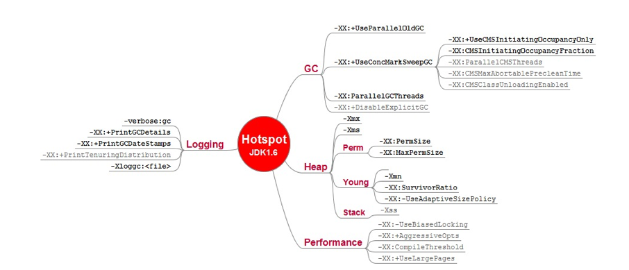

# JVM参数与JVM工具使用

## JVM常用参数

[HotSpot JVM参数官方文档](https://www.oracle.com/technetwork/java/javase/tech/vmoptions-jsp-140102.html)

主要分为三类：标准参数、-X非标准参数、-XX非标准参数。

命令行查看参数说明
```sh
java -help  #查看标准参数
java -X     #查看非标准参数
java -XX:+PrintFlagsFinal   #查看所有-XX参数
jinfo -flags <pid>          #查看正在运行的java进程启用的参数
jinfo -flag <premeter> <pid>   #查看正在运行java进程某个参数的值
```

+ 常用配置参数


  | 参数 | 功能 |
  |:----|:--------|
  | -Xms | 初始堆大小。如：-Xms256m |
  | -Xmx | 最大堆大小。如：-Xmx512m |
  | -Xmn | 新生代大小。通常为 Xmx 的 1/3 或 1/4。新生代 = Eden + 2 个 Survivor 空间。实际可用空间为 = Eden + 1 个 Survivor，即 90% |
  | -Xss | JDK1.5+ 每个线程堆栈大小为 1M，一般来说如果栈不是很深的话， 1M 是绝对够用了的。|
  | -XX:NewRatio | 新生代与老年代的比例，如 –XX:NewRatio=2，则新生代占整个堆空间的1/3，老年代占2/3 |
  | -XX:SurvivorRatio | 新生代中 Eden 与 Survivor 的比值。默认值为 8。即 Eden 占新生代空间的 8/10，另外两个 Survivor 各占 1/10 |
  | -XX:+HeapDumpOnOutOfMemoryError | 让虚拟机在发生内存溢出时 Dump 出当前的内存堆转储快照，以便分析用 |
  | -XX:-+DisableExplicitGC | 禁用 System.gc()，由于该方法默认会触发 FGC，并且忽略参数中的 UseG1GC 和 UseConcMarkSweepGC，因此必要时可以禁用该方法。|
  | -XX:+ExplicitGCInvokesConcurrent | 该参数可以改变上面的行为，也就是说，System.gc() 后不使用 FGC ，而是使用配置的并发收集器进行并发收集。注意：使用此选项就不要 使用 上面的选项。 |
  | -XX:-ScavengeBeforeFullGC | 由于大部分 FGC 之前都会 YGC，减轻了 FGC 的压力，缩短了 FGC 的停顿时间，但也可能你不需要这个特性，那么你可以使用这个参数关闭，默认是 ture 开启。 |
  | -XX:MaxTenuringThreshold={value} | 新生代 to 区的对象在经过多次 GC 后，如果还没有死亡，则认为他是一个老对象，则可以晋升到老年代，而这个年龄（GC 次数）是可以设置的，有就是这个参数。默认值时15。超过15 则认为是无限大(因为age变量时4个 bit，超过15无法表达)。但该参数不是唯一决定对象晋升的条件。当 to 区不够或者改对象年龄已经达到了平均晋升值或者大对象等等条件。|
  | -XX:TargetSurvivorRatio={value} | 决定对何时晋升的不仅只有 XX:MaxTenuringThreshold 参数，如果在 Survivor 空间中相同年龄所有对象大小的总和大鱼 Survivor 空间的一半（默认50%），年龄大于或等于该年龄的对象就可以直接进入老年代。无需在乎 XX:MaxTenuringThreshold参数。因此，MaxTenuringThreshold 只是对象晋升的最大年龄。如果将 TargetSurvivorRatio 设置的很小，对象将晋升的很快。|
  | -XX:PretenureSizeThresholds={value} | 除了年龄外，对象的体积也是影响晋升的一个关键，也就是大对象。如果一个对象新生代放不下，只能直接通过分配担保机制进入老年代。该参数是设置对象直接晋升到老年代的阈值，单位是字节。只要对象的大小大于此阈值，就会直接绕过新生代，直接进入老年代。注意： 这个参数只对 Serial 和 ParNew 有效，ParallelGC 无效 ，默认情况下该值为0，也就是不指定最大的晋升大小，一切有运行情况决定。|
  | -XX:-UseTLAB | 禁用线程本地分配缓存。TLAB 的全称是 Thread LocalAllocation Buffer ，即线程本地线程分配缓存，是一个线程私有的内存区域。该设计是为了加速对象分配速度。由于对象一般都是分配在堆上，而对是线程共享的。因此肯定有锁，虽然使用 CAS 的操作，但性能仍有优化空间。通过为每一个线程分配一个 TLAB 的空间（在 eden 区），可以消除多个线程同步的开销。默认开启。 |
  | -XX:TLABSize | 指定 TLAB 的大小|
  | -XX:+PrintTLAB | 跟踪 TLAB 的使用情况。用以确定是用多大的 TLABSize。 |
  | -XX:+ResizeTLAB | 自动调整 TLAB 大小。 |

+ 调试参数

  | 参数 | 功能 |
  |:----|:--------|
  | -XX:+PrintGC | 输出简要GC日志 |
  | -XX:+PrintGCDetails | 输出详细GC日志 |
  | -Xloggc:gc.log | 输出GC日志到文件 |
  | -XX:+PrintGCTimeStamps | 输出GC的时间戳（以JVM启动到当期的总时长的时间戳形式）|
  | -XX:+PrintGCDateStamps | 输出GC的时间戳（以日期的形式，如 2013-05-04T21:53:59.234+0800）|
  | -XX:+PrintHeapAtGC | 在进行GC的前后打印出堆的信息 |
  | -verbose:gc ||
  | -XX:+PrintReferenceGC | 打印年轻代各个引用的数量以及时长 |
  | -XX:+TraceClassLoading | 程序运行时输出类加载过程信息 |


## JVM调试工具

想要的工具人家都做好了。

### jps（JVM进程状态工具）

常用参数：  
```
-q 不输出类名、Jar名和传入main方法的参数  
-m 输出传入main方法的参数  
-l 输出main类或Jar的全限名  
-v 输出传入JVM的参数  
```

### jinfo（实时查看和调整JVM配置参数）

常用参数：  
```
jinfo -flag <name> PID  
jinfo -flag [+|-]<name> PID – 布尔型参数  
jinfo -flag <name>=<value> PID – 数字或字符型参数  
```

### Jmap（Java内存映射工具）

可能需要先打开开关（Linux）:

```
$ sudo vi /etc/sysctl.d/10-ptrace.conf
kernel.yama.ptrace_scope = 0
```

用法：

```text
Usage:
    jmap [option] <pid>
        (to connect to running process)
    jmap [option] <executable <core>
        (to connect to a core file)
    jmap [option] [server_id@]<remote server IP or hostname>
        (to connect to remote debug server)

where <option> is one of:
    <none>               to print same info as Solaris pmap
    -heap                打印heap的概要信息，如GC使用的算法，heap的配置及JVM堆内存的使用情况
    -histo[:live]        打印每个class的实例数目,内存占用,类全名信息. VM的内部类名字开头会加上前缀”*”. 
    					 如果live子参数加上后,只统计活的对象数量.
    -clstats             to print class loader statistics
    -finalizerinfo       打印正等候回收的对象的信息
    -dump:<dump-options> to dump java heap in hprof binary format
                         dump-options:
                           live         dump only live objects; if not specified,
                                        all objects in the heap are dumped.
                           format=b     binary format
                           file=<file>  dump heap to <file>
                         Example: jmap -dump:live,format=b,file=heap.bin <pid>
    -F                   force. Use with -dump:<dump-options> <pid> or -histo
                         to force a heap dump or histogram when <pid> does not
                         respond. The "live" suboption is not supported
                         in this mode.
    -h | -help           to print this help message
    -J<flag>             to pass <flag> directly to the runtime system
```


### Jstat (JVM统计信息监视工具)

jstat命令可以查看堆内存各部分的使用量，以及加载类的数量。命令的格式如下：
jstat [-命令选项] [vmid] [间隔时间(毫秒)] [查询次数]

```shell
$ jstat -help
Usage: jstat -help|-options
       jstat -<option> [-t] [-h<lines>] <vmid> [<interval> [<count>]]
  -t 			把时间戳列显示为输出的第一列。这个时间戳是从Java虚拟机的开始运行到现在的秒数。
  -h<lines> 	每显示lines行显示一次表头，其中lines为正整数。默认值为0，即仅在第一行数据显示一次表头。
Definitions:
  <option>      详见 jstat -options
  <vmid>        Virtual Machine Identifier. A vmid takes the following form:
                     <lvmid>[@<hostname>[:<port>]]
                Where <lvmid> is the local vm identifier for the target
                Java virtual machine, typically a process id; <hostname> is
                the name of the host running the target Java virtual machine;
                and <port> is the port number for the rmiregistry on the
                target host. See the jvmstat documentation for a more complete
                description of the Virtual Machine Identifier.
  <lines>       Number of samples between header lines.
  <interval>    采样间隔，整数，可以加单位符号ms或s,不加默认ms,<n>["ms"|"s"]
  <count>       采样数量
  -J<flag>      Pass <flag> directly to the runtime system.

$ jstat -options
-class				# 显示加载class的数量，及所占空间等信息
-compiler			# 显示VM实时编译的数量等信息
-gc					# 垃圾回收统计
-gccapacity			# 堆内存统计
-gccause
-gcmetacapacity		# 元数据空间统计
-gcnew				# 新生代垃圾回收统计
-gcnewcapacity		# 新生代内存统计
-gcold				# 老年代垃圾回收统计
-gcoldcapacity		# 老年代内存统计
-gcutil				# 统计gc信息
-printcompilation
```

> 命令行doc格式说明：
>
> 1. `[]`：内的内容是可选的
> 2. `{}`：一组必须的项目，必须要在{a|b|c}内给出的选择里选一个。
> 3. `<>`：表示必须被替换的占位
>
> `[<interval> [<count>]]`意义：使用count参数前提是必须指定interval参数。

#### jstat -gc 垃圾回收统计

结果字段：

```text
S0C：第一个幸存区的大小，单位KB
S1C：第二个幸存区的大小
S0U：第一个幸存区的使用大小
S1U：第二个幸存区的使用大小
EC：伊甸园区的大小
EU：伊甸园区的使用大小
OC：老年代大小
OU：老年代使用大小
MC：方法区大小(元空间)
MU：方法区使用大小
CCSC:压缩类空间大小
CCSU:压缩类空间使用大小
YGC：年轻代垃圾回收次数
YGCT：年轻代垃圾回收消耗时间，单位s
FGC：老年代垃圾回收次数
FGCT：老年代垃圾回收消耗时间，单位s
GCT：垃圾回收消耗总时间，单位s
```

这是最常用的功能，这里用这个工具分析下之前测试软引用遗留的问题“SoftReferenceTest.java 为何是在堆占用27M的时候回收了软引用的对象，而不是在29M的时候？”，**其实应该还是计算误差和忽略了除测试对象代码本身也会占用一部分堆空间，实际可能已经很接近29M了，下面监控看到回收软链接前老年代, from, eden 基本都满了，老年代已没法接收eden区存活的对象了**。
代码参考java文件，程序本身有些对象要占用栈空间，为了不影响分析将测试对象内存占用都增加10倍。

> 本来要填坑的结果又挖了两个坑！！！
>
> + 下面测试程序刚启动时的10755.1K eden空间都是被哪些对象占用的？
> + 老年代担保机制的“历史每次minor gc进入老年代的对象平均大小”是怎么计算的？加权平均算法原理？

```shell
jps -lm 
jstat -gc 19736 1000 100
```

gc统计结果

```shell
 S0C    S1C    S0U    S1U      EC       EU        OC         OU       MC     MU    CCSC   CCSU   YGC     YGCT    FGC    FGCT     GCT   
# 不清楚这里还没创建软链接对象的时候就占用的10755.1K eden空间都是被谁占用的，后面用jmap看下
12800.0 12800.0  0.0    0.0   76800.0  10755.1   204800.0     0.0     4480.0 781.2  384.0   76.6       0    0.000   0      0.000    0.000
...
12800.0 12800.0  0.0    0.0   76800.0  10755.1   204800.0     0.0     4480.0 781.2  384.0   76.6       0    0.000   0      0.000    0.000
# 创建50M的软链接对象
12800.0 12800.0  0.0    0.0   76800.0  61955.2   204800.0     0.0     4480.0 781.2  384.0   76.6       0    0.000   0      0.000    0.000
# 往list插入一个0.5M的对象
12800.0 12800.0  0.0    0.0   76800.0  67075.2   204800.0     0.0     4480.0 781.2  384.0   76.6       0    0.000   0      0.000    0.000
12800.0 12800.0  0.0    0.0   76800.0  72195.2   204800.0     0.0     4480.0 781.2  384.0   76.6       0    0.000   0      0.000    0.000
# count=2时，eden 空间不足，发生young gc，存活下来的对象先放survivor区，survivor不足剩余对象直接丢老年代
# 之前那些不知来源的10M内存，大部分都被回收掉了
# 然后往list插入一个5M的对象
12800.0 12800.0  0.0   11808.0 76800.0   5120.0   204800.0   51208.0   5504.0 5192.1 640.0  592.7       1    0.053   0      0.000    0.053
12800.0 12800.0  0.0   11808.0 76800.0  11694.4   204800.0   51208.0   5504.0 5192.1 640.0  592.7       1    0.053   0      0.000    0.053
12800.0 12800.0  0.0   11808.0 76800.0  73134.5   204800.0   51208.0   5504.0 5192.1 640.0  592.7       1    0.053   0      0.000    0.053
# 继续一个个得插入5M的对象，直到eden内存再次不足
# 再次发生 young gc, survivor已占满，5M的对象都丢到老年代
# 然后往list插入一个5M的对象
12800.0 12800.0 11392.0  0.0   76800.0   6656.0   204800.0   122896.2  5504.0 5196.6 640.0  592.7       2    0.078   0      0.000    0.078
12800.0 12800.0 11392.0  0.0   76800.0  13256.6   204800.0   122896.2  5504.0 5196.6 640.0  592.7       2    0.078   0      0.000    0.078
12800.0 12800.0 11392.0  0.0   76800.0  74696.8   204800.0   122896.2  5504.0 5196.6 640.0  592.7       2    0.078   0      0.000    0.078
# 和上面一样又一个循环，但是这次有个 Full GC (Ergonomics)，这里应该是老年代担保机制触发的full gc
# 老年代剩余空间（大约80M） < 新生代所有对象(将近86M) 但是这里老年代剩余空间（82M）不小于 历史每次minor gc进入老年代对象平均大小（122896.2K/2），
# 为何会触发老年代担保机制？经过查资料说是求加权平均，具体怎么计算和触发的有机会还是看源码吧。
# 虽然触发 full gc但并没回收多少内存，但是所幸内存还够用
12800.0 12800.0  0.0   5766.5 76800.0   5120.0   204800.0   200015.8  5504.0 5198.1 640.0  592.7       3    0.101   1      0.032    0.133
12800.0 12800.0  0.0   5766.5 76800.0  11718.4   204800.0   200015.8  5504.0 5198.1 640.0  592.7       3    0.101   1      0.032    0.133
12800.0 12800.0  0.0   5766.5 76800.0  73158.5   204800.0   200015.8  5504.0 5198.1 640.0  592.7       3    0.101   1      0.032    0.133
# 又一个循环
# 这次实在没什么垃圾对象可回收了,且老年代基本已经满了，只能将软引用对象回收了,腾出50M
# 可以看到eden区只是存活对象中的一部分转移到了老年代，且立马把软链接对象腾出的空间给占满了
12800.0 12800.0  0.0    0.0   76800.0  31294.5   204800.0   199998.4  5504.0 5194.3 640.0  592.1       3    0.101   3      0.087    0.188
12800.0 12800.0  0.0    0.0   76800.0  37902.1   204800.0   199998.4  5504.0 5194.3 640.0  592.1       3    0.101   3      0.087    0.188
# 继续一个个加入5M对象
12800.0 12800.0  0.0    0.0   76800.0  73742.2   204800.0   199998.4  5504.0 5194.3 640.0  592.1       3    0.101   3      0.087    0.188
# 只剩强引用了，已经无可回收了，且堆区都占满了，抛出OOM
```

程序运行日志

```text
create soft reference ...
count: 0 srObj==null?false
...
count: 2 srObj==null?false
[GC (Allocation Failure) [PSYoungGen: 72195K->11808K(89600K)] 72195K->63016K(294400K), 0.0527147 secs] [Times: user=0.27 sys=0.04, real=0.05 secs] 
count: 3 srObj==null?false
...
count: 16 srObj==null?false
[GC (Allocation Failure) [PSYoungGen: 84942K->11392K(89600K)] 136150K->134288K(294400K), 0.0250799 secs] [Times: user=0.09 sys=0.09, real=0.02 secs] 
count: 17 srObj==null?false
...
count: 30 srObj==null?false
[GC (Allocation Failure) [PSYoungGen: 86088K->11344K(89600K)] 208985K->205920K(294400K), 0.0235928 secs] [Times: user=0.04 sys=0.11, real=0.02 secs] 
[Full GC (Ergonomics) [PSYoungGen: 11344K->5766K(89600K)] [ParOldGen: 194576K->200015K(204800K)] 205920K->205782K(294400K), [Metaspace: 5198K->5198K(1056768K)], 0.0319888 secs] [Times: user=0.17 sys=0.00, real=0.04 secs] 
count: 31 srObj==null?false
...
count: 44 srObj==null?false
[Full GC (Ergonomics) [PSYoungGen: 78925K->77446K(89600K)] [ParOldGen: 200015K->200015K(204800K)] 278940K->277462K(294400K), [Metaspace: 5198K->5198K(1056768K)], 0.0272587 secs] [Times: user=0.11 sys=0.01, real=0.03 secs] 
[Full GC (Allocation Failure) [PSYoungGen: 77446K->26174K(89600K)] [ParOldGen: 200015K->199998K(204800K)] 277462K->226172K(294400K), [Metaspace: 5198K->5194K(1056768K)], 0.0274282 secs] [Times: user=0.16 sys=0.00, real=0.03 secs] 
count: 45 srObj==null?true
...
count: 53 srObj==null?true
[Full GC (Ergonomics) [PSYoungGen: 73742K->72254K(89600K)] [ParOldGen: 199998K->199998K(204800K)] 273740K->272253K(294400K), [Metaspace: 5194K->5194K(1056768K)], 0.0195432 secs] [Times: user=0.09 sys=0.00, real=0.02 secs] 
[Full GC (Allocation Failure) [PSYoungGen: 72254K->72254K(89600K)] [ParOldGen: 199998K->199998K(204800K)] 272253K->272253K(294400K), [Metaspace: 5194K->5194K(1056768K)], 0.0086164 secs] [Times: user=0.03 sys=0.00, real=0.00 secs] 
java.lang.OutOfMemoryError: Java heap space
```

### jstatd（JVM的jstat守护进程）

### jconsole（监视与管理）

### [jcmd](https://download.java.net/java/early_access/panama/docs/specs/man/jcmd.html)

常用参数：

+ **VM.native_memory**

  需要先开启[Native Memory Tracking](https://docs.oracle.com/javase/8/docs/technotes/guides/troubleshoot/tooldescr007.html), 使用`-XX:NativeMemoryTracking=summary`或`-XX:NativeMemoryTracking=detail`参数。

### sa-jdi （hotspot debugger：HSDB）

