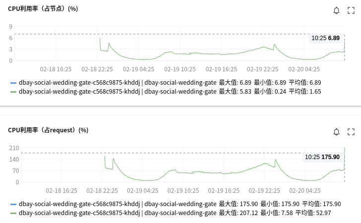
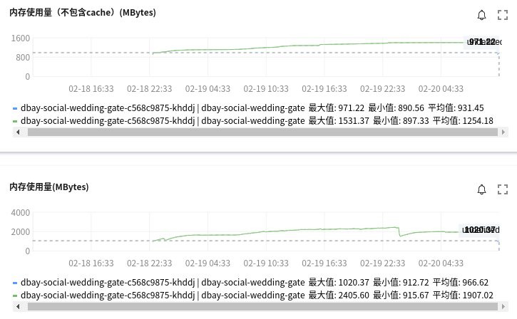

# 实例场景

## 案例

+ **分析线上Web应用占用内存是否合理**

  **现象**：wedding-gate内存(不包含cache)在一天之内就从启动稳定后的1G爬升到1.348G，wedding在这半个月内内存也是在慢慢往上爬的。

  2天内CPU和内存占用曲线：

  

  

  CPU利用率反映了业务繁忙程度，可以看到有忙有闲，但是内存使用量（不包含cache）却是在不断攀升[cache占用是日志文件导致的，这里只分析导致非cache内存占用不断上升的原因]。

  **猜想**：

  是业务量大导致内存占用多还是代码实现上不合理或者有内存泄漏什么的？

  内存使用上有没有优化空间？

  **分析流程**：

  + **先查看下JVM参数**

    ```shell
    
    ```
  # jinfo -flags <pid>
    jinfo -flags 10
    ```

    结果：
  
    ```
  Attaching to process ID 10, please wait...
    Debugger attached successfully.
    Server compiler detected.
    JVM version is 25.265-b01
    Non-default VM flags: 
    -XX:CICompilerCount=2 
    -XX:CompressedClassSpaceSize=125829120 
    -XX:ConcGCThreads=1 
    -XX:ErrorFile=null 
    -XX:G1HeapRegionSize=1048576 
    -XX:+HeapDumpOnOutOfMemoryError 
    -XX:InitialHeapSize=1073741824 
    -XX:MarkStackSize=4194304 
    -XX:MaxDirectMemorySize=134217728 
    -XX:MaxHeapSize=1073741824 
    -XX:MaxMetaspaceSize=134217728 
    -XX:MaxNewSize=643825664 
    -XX:MetaspaceSize=134217728 
    -XX:MinHeapDeltaBytes=1048576 
    -XX:+PrintGC 
    -XX:+PrintGCDateStamps 
    -XX:+PrintGCDetails 
    -XX:+PrintGCTimeStamps 
    -XX:+PrintHeapAtGC 
    -XX:+PrintTenuringDistribution 
    -XX:+UseCompressedClassPointers 
    -XX:+UseCompressedOops 
    -XX:+UseG1GC 
    -XX:+UseStringDeduplication 
    Command line:  
    -Xms1024M 
    -Xmx1024M 
    -XX:MetaspaceSize=128M 
    -XX:MaxMetaspaceSize=128M 
    -XX:MaxDirectMemorySize=128M 
    -XX:+UseStringDeduplication 
    -XX:+HeapDumpOnOutOfMemoryError 
    -verbose:gc 
    -XX:+PrintGCDateStamps 
    -XX:+PrintGCDetails 
    -XX:+UseG1GC 
    -XX:+PrintHeapAtGC 
    -XX:+PrintGCTimeStamps 
    -XX:+PrintTenuringDistribution 
    -Xloggc:/home/wedgate/log/build20210205_085952/run20210220_101543/gc.log 
    -XX:ErrorFile=/home/wedgate/log/build20210205_085952/run20210220_101543/error.log
  
  ```
  
  
  ```
  
+ **JVisualVm快照分析内存是被哪些对象不断吃掉的？**
  
  应用是腾讯云k8s docker容器中部署的，怎么连接？
  

  
  + **jmap 堆内存分析**
  
    ```shell
  #先进入容器内部
    jmap -heap pid
    ```
  ```
  
    结果
  
    ```txt
  Attaching to process ID 10, please wait...
    Debugger attached successfully.
    Server compiler detected.
    JVM version is 25.265-b01
    
    using thread-local object allocation.
    Garbage-First (G1) GC with 2 thread(s)
    
    Heap Configuration:
       MinHeapFreeRatio         = 40
       MaxHeapFreeRatio         = 70
       MaxHeapSize              = 1073741824 (1024.0MB)
       NewSize                  = 1363144 (1.2999954223632812MB)
       MaxNewSize               = 643825664 (614.0MB)
       OldSize                  = 5452592 (5.1999969482421875MB)
       NewRatio                 = 2
       SurvivorRatio            = 8
       MetaspaceSize            = 134217728 (128.0MB)
       CompressedClassSpaceSize = 125829120 (120.0MB)
       MaxMetaspaceSize         = 134217728 (128.0MB)
       G1HeapRegionSize         = 1048576 (1.0MB)
    
    Heap Usage:
    G1 Heap:
       regions  = 1024
       capacity = 1073741824 (1024.0MB)
       used     = 616068080 (587.5283050537109MB)
       free     = 457673744 (436.47169494628906MB)
       57.37581104040146% used
    G1 Young Generation:
    Eden Space:
       regions  = 175
       capacity = 550502400 (525.0MB)
       used     = 183500800 (175.0MB)
       free     = 367001600 (350.0MB)
       33.333333333333336% used
    Survivor Space:
       regions  = 9
       capacity = 9437184 (9.0MB)
       used     = 9437184 (9.0MB)
       free     = 0 (0.0MB)
       100.0% used
    G1 Old Generation:
       regions  = 404
       capacity = 513802240 (490.0MB)
       used     = 423130096 (403.52830505371094MB)
       free     = 90672144 (86.47169494628906MB)
       82.35271531708386% used
  ```
  
  多打印几次（能用VisualVM,还是应该用VisualVM），如果几个GC周期内，堆几个区占用内存加起来，稳定在某个区间，堆内存就是正常的。
  
+ **方法区内存分析**
  
  也受垃圾回收机制管，和代码量相关，一般不会出现问题。
  
+ **jcmd 堆外内存分析**
  
  除了堆内存以外的都是堆外内存（不太确定方法区、程序计时器、虚拟机栈、本地方法栈是否也都属于堆外内存，假设概念上包含这些部分）。
  
  + 程序计数器、本地方法栈
  
    此案例的问题不可能是这两个区域出问题导致的。
  
  + 虚拟机栈
  
    属于线程私有，创建线程越多，占用内存越多。
  
      先查下这个进程的所有线程信息
  
      ```shell
     top -H -p <pid>		
       #显示有257个线程
       
     # -L     Show threads, possibly with LWP and NLWP columns.
     ps -p <pid> -L -o pcpu,pmem, size, vsize,pid,tid,time,tname
      ```
  
      这个线程数量是不是有点多且基本上都在sleeping. 其中http-nio-xxx占了大多数。
  
    是不是HTTP连接设置的问题？
  
    HTTP请求从建立连接到释放的详细流程？
  
    + 通过Unsafe操作的内存（比如NIO, Netty中相关类，本质都是通过Unsafe分配的）
  
    wedding-gate涉及NIO的只有HTTP请求。
  
+ **OOM分析（如果有OOM的话）**
  
    是业务量大了？还是程序没有释放垃圾内存？
  
    MAT分析流程：
  
    + 添加dump运行参数
    
      ```
    -XX: +HeapDumpOnOutOfMemoryError
      ```
    
    + OOM后获取.hprof文件
    
      也可以通过jmap手动导出
    
      ```shell
    jmap -dump:format=b,file=heap.hprof <pid>
      ```
    
    + 使用MAT分析内存占用报表

  

  **参考**：

  [记一次java应用内存不断增长问题解决过程](https://blog.csdn.net/longaiyunlay/article/details/102787768)

  

## 内存问题总结

