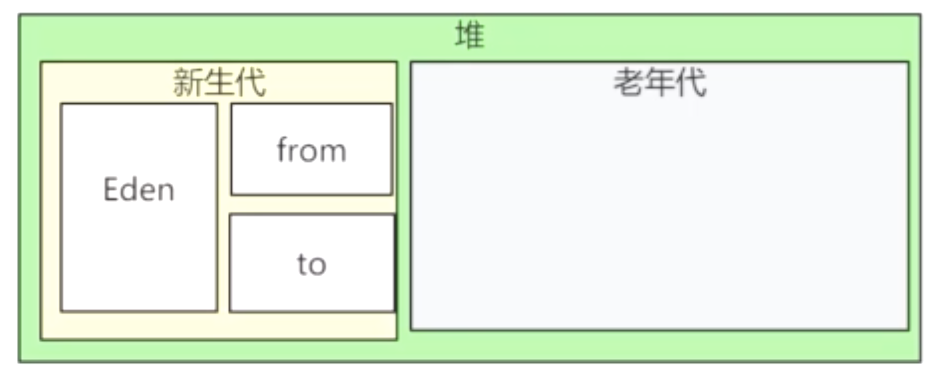
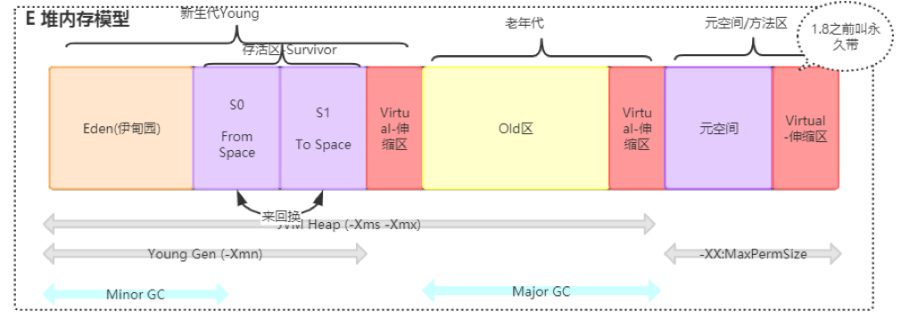
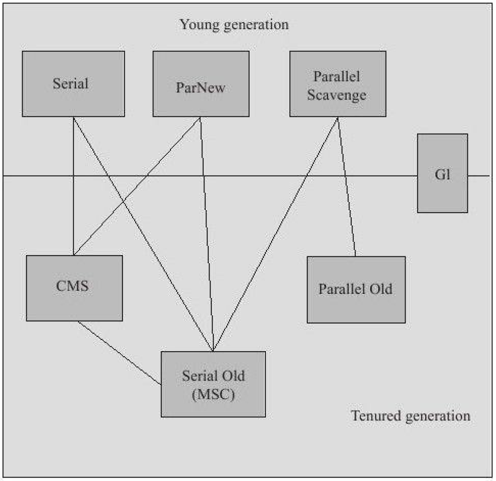

# 垃圾回收GC

具体参考Oracle文档：

[Java虚拟机规范](https://docs.oracle.com/javase/specs/jvms/se8/html/)  
[Oracel Hotspot docs](https://www.oracle.com/technetwork/java/javase/tech/index-jsp-136373.html)  


## 需要掌握

+ 内存分配流程？

+ 垃圾回收是针对JVM内存哪个分区的？

+ 堆内部分区？

+ 简述垃圾回收机制？

+ 对象是否存活（GC对象）的判定方法？

+ Java垃圾收集方法？

## GC流程

### 回收目标

GC是针对堆和方法区。
因为程序计数器、虚拟机栈、本地方法栈3个区域随线程而生，随线程而灭。而Java堆和方法区则不一样，一个接口的多个实现类需要的内存可能不一样，一个方法中的多个分支需要的内存也可能不一样，我们只有在程序处于运行期间时才能知道会创建哪些对象，这部分内存的分配和回收都是动态的，垃圾收集器所关注的是这部分内存。

#### 堆内部分区与内存分配



堆分区是由GC收集算法决定的，之所以说堆分区分为新生代和老年代是因为现在的垃圾收集器都是用的分代收集算法。

当前主流的虚拟机都是按照可扩展来实现的（通过-Xmx和-Xms控制）。如果在堆中没有内存完成实例分配，并且堆也无法再扩展时，将会抛出OutOfMemoryError异常。

新生代空间：老年代空间 = 1:2  
Eden(伊甸园)：s0(from survivor):s1(to survivor) = 8:1:1  

堆内存在系统内存空间的分布模型：


对象内存分配：  
Java 的自动内存管理主要是针对++对象内存的回收和对象内存的分配++。同时，Java 自动内存管理最核心的功能是++堆内存中对象的分配与回收++。

分代回收算法：  

1）新对象内存优先会分配到Eden区（大对象除外，会直接分配到老年代）；  
2）当Eden区被对象占满，触发 Minor GC，对新生代空间对象进行回收（Eden和from survivor），Minor GC 非常频繁且效率高；  
2.1）Minor GC会检查新生代Eden和from survivor中对象是否应该被回收，能被回收的对象会被立即回收，无法回收的对象会被加入到from survivor区并且对象头age（使用4个字节存储）加1，已经位于from survivor区的对象无法回收的age也加1，然后from survivor和to survivor区间互换。  
2.2）每次Minor GC后from survivor中的对象的age都会加1；  
2.3）如果from survivor中对象age还小于15，但是from survivor空间占用已经达到了50%（由*TargetSurvivorRatio指定）以上则会按年龄从小到大进行累加，当加入某个年龄段后，累加和超过survivor区域*TargetSurvivorRatio的值的时候，就将这个年龄段往上的年龄的对象直接移到老年代。  
3）当from survivor区中的对象的age等于15（默认为15，四个字节最大值），则对象会被移到老年代存储。  
4）当老年代空间逐渐被对象占满之后则会触发 Major GC（Full GC），对老年代对象进行回收， Major GC 一般都会触发 Minor GC（但是不是绝对触发）。Major GC 效率一般比 Minor GC 效率低10倍以上，所以经常触发STW（Stop The World）即可能会卡顿。  

PS：  
**大对象**：需要大量连续内存空间的对象（比如字符串、数组），使用-XX:PretenureSizeThreshold定义大对象的大小边界（此参数需要配合Serial、PartNew等收集器使用），将大对象直接在老年代分配可以避免在新生代发生大量的内存复制。

#### 为何将方法区从“永久代”替换为“元空间”

整个永久代有一个 JVM 本身设置固定大小上限，无法进行调整，而元空间使用的是直接内存，受本机可用内存的限制，虽然元空间仍旧可能溢出，但是比原来出现的几率会更小。

当你元空间溢出时会得到如下错误： java.lang.OutOfMemoryError: MetaSpace

可以使用 -XX:MaxMetaspaceSize 标志设置最大元空间大小，默认值为 unlimited，这意味着它只受系统内存的限制。-XX:MetaspaceSize 调整标志定义元空间的初始大小如果未指定此标志，则 Metaspace 将根据运行时的应用程序需求动态地重新调整大小。
元空间里面存放的是类的元数据，这样加载多少类的元数据就不由 MaxPermSize 控制了, 而由系统的实际可用空间来控制，这样能加载的类就更多了。

## GC判断策略（对象内存是否应该回收）

+ **引用计数法**

  无法解决对象循环引用的问题。

+ **可达性分析**

  GCRoot对象可以是哪些？

  GCRoot对象都是选用非堆内存中的对象，能作为根的都是些始祖（无法往上继续溯源）对象。
  而能作为始祖的有下面四种：

  + 虚拟机栈(栈帧中的本地变量表)中引用的对象；

    比如某个方法中局部变量引用的对象（注意方法退出后这个局部变量就不存在了）。

  + 方法区中的类静态属性引用的对象

    比如类的静态成员应用的对象。

  + 方法区中的常量引用的对象

  + 原生方法栈（Native Method Stack）中 JNI 中引用的对象。

### Java中四种引用

根据对引用对象内存回收的限制程度区分：

+ **强引用**[寸土不让]（工作中大部分都是这种）

  除非对象不可达，否则即使报内存耗尽也不能回收。

+ **软引用**[实在困难了可以通融]

  ++这种引用在实现缓存机制的时候使用的比较多,还可以防止缓存过大造成OOM++。

  如果一个对象只有软引用，当内存不足的时候GC可以回收它，
  但是内存充足的时候不可以回收。

+ **弱引用**[老好人]

  ++WeakHashMap中的键使用了软引用，当程序中引用这个键的强引用被删除后，这个键值对可以在未来很快被JVM回收。++

  如果一个对象只有弱引用，GC想回收它可以随时回收。
  在回收流程中扫描到弱引用的话，不管内存是否紧张都会回收它。

+ **虚引用**[形同不存在]

  GC可以在任何时候回收它，虚引用主要用来跟踪对象被垃圾回收的活动。

### 不可达对象的二次标记

参考：《深入理解JVM》3.2.4

涉及Object类finalize()方法的使用。这个finalize()是给用户提供的用于调整GC回收措施的，对象在GC之前会被调用一次此方法且仅调用一次。

不可达对象的二次标记其实是针对重写finalize()方法而言的，如果finalize()没有被重写，则JVM认为就按默认的回收处理直接就回收了；如果重写之后，就需要重新判断对象是否可回收（万一用户在finalize()中重新引用了该对象呢？），具体流程：若对象未执行过finalize方法，将其放入F-Queue队列，由一低优先级线程执行该队列中对象的finalize方法。执行finalize方法完毕后，GC会再次判断该对象是否可达，若不可达，则进行回收，否则，对象“复活”,但是复活之后再次不可达之后会直接被回收。


## GC收集算法（什么时候回收）

### 四种回收算法

+ **复制算法**（内存使用率低）

  这种情况堆内存只有一半可用，每次回收将存活下来的对象拷贝到另一半空白空间，而将当前这半空间数据清空。

+ **标记清除**（清除效率低，容易产生碎片空间）

  先将可以回收的对象的地址空间全部标记起来，最后统一定点清除。

+ **标记整理**(清除效率低)

  可以理解为标记清除+整理，将垃圾对象清除之后，将存活对象全部移动到一端连续的内存里面。

+ **分代收集**（现在基本都采用此算法）

  即前面介绍的分代回收算法，综合使用了上面的回收算法，from和to区很明显就是复制算法。

### 如何手动触发GC回收

```java
//下面两种写法是完全一样的
System.gc()
Runtime.getRuntime().gc()
```

## GC收集器（怎么回收）

参考：《深入理解JVM》3.5垃圾收集器



GC回收器是回收算法的具体的实现。


+ Serial （-XX:+UseSerialGC）

  会暂停所有工作线程，导致STW。

+ Serial old

+ PartNew （-XX:+UseParNewGc）

  Serial的多线程版本，仍然会引起STW。

+ Parallel Scanvenge （-XX:+UseParallelGC）

  着重提高CPU吞吐量，吞吐量就是 CPU 中用于运行用户代码的时间与 CPU 总消耗时间的比值。Parallel Scavenge 收集器提供了很多参数供用户找到最合适的停顿时间或最大吞吐量。

+ Parallel old （-XX:-UseParallelOldGC）

+ **CMS**（-XX:+UseConcMarkSweepGC）

  CMS(并发标记清除)以获取最短回收停顿时间为目标，注重用户体验。

  CMS（Concurrent Mark Sweep）收集器是 HotSpot 虚拟机第一款真正意义上的并发收集器，它第一次实现了让垃圾收集线程与用户线程（基本上）同时工作。

  **CMS处理过程有七个步骤**：
  1. 初始标记(CMS-initial-mark) ,会导致swt；
  2. 并发标记(CMS-concurrent-mark)，与用户线程同时运行；
  3. 预清理（CMS-concurrent-preclean），与用户线程同时运行；
  4. 可被终止的预清理（CMS-concurrent-abortable-preclean） 与用户线程同时运行；
  5. 重新标记(CMS-remark) ，会导致swt；
  6. 并发清除(CMS-concurrent-sweep)，与用户线程同时运行；
  7. 并发重置状态等待下次CMS的触发(CMS-concurrent-reset)，与用户线程同时运行；

  

  主要优点：并发收集、低停顿。  
  但是它有下面三个明显的缺点：  
  + 对 CPU 资源敏感；
  +	无法处理浮动垃圾；（下一次回收）
  + 它使用的回收算法-“标记-清除”算法会导致收集结束时会有大量空间碎片产生（不做整理 -XX:CMSFullGCsBeforeCompaction=n 多少次之后做压缩）。

+ **G1** （-XX:+UseG1GC）

## GC日志分析

GC日志分析可视化工具：[Gceasy](https://gceasy.io/)

GC日志格式：

  
  
```
# Minor GC
[GC (Allocation Failure) [PSYoungGen: 8836K->1008K(9216K)] 14668K->14552K(29696K), 0.0046324 secs] [Times: user=0.02 sys=0.01, real=0.00 secs] 

GC：Minor GC
Allocation Faulure： 产生此次GC的原因，这个日志的原因是年轻代中没有足够区域能够存放需要分配的数据而失败
PSYoungGen：被GC的区域类型，这里指新生代区域。
8836K：新生代被GC前的大小，
1008K：新生代被GC后的大小，
9216K：新生代总共大小，JVM参数里面分配了10M，Eden:from:to=8:1:1,即9*1024K，可以存储对象的空间；
14668K：YoungGC前JVM堆占用；
14552K：YoungGC后JVM堆占用；
29696K：堆总大小，新生代的9*1024+老年代的20*1024 = 29696K；
0.0046324 secs：Minor GC耗时；
0.02: MinorGC用户耗时；
0.01: MinorGC系统耗时；
0.00: MinorGC实际耗时。

# Full GC
[Full GC (Ergonomics) [PSYoungGen: 1008K->0K(9216K)] [ParOldGen: 13544K->14055K(20480K)] 14552K->14055K(29696K), [Metaspace: 4955K->4955K(1056768K)], 0.0087818 secs] [Times: user=0.02 sys=0.00, real=0.01 secs] 
FullGC 在 MinorGC日志基础上增加了老年代和元空间的内存占用信息。
```

[GC触发的原因](https://blog.csdn.net/weixin_43194122/article/details/91526740)

