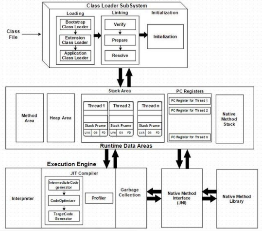

# JVM类加载机制



类加载即将Java类的字节码文件加载到机器内存中,并在内存中构建出Java类的原型——类模板对象 。所谓类模板对象,其实就是Java类在JVM内存中的一个快照,JVM将从字节码文件中解析出的常量池 、类字段、类方法等信息存储到类模板中,这样JVM在运行期便能通过类模板而获取 Java 类中的任意信息 ,能够对 Java 类的成员变量进行遍历,也能进行Java方法的调用。反射的机制即基于这一基础 。

在Java 里面连接是在程序运行期间完成的，而不是像C/C++那样在编译期间进行连接，
因此当需要小改线上项目时，我们可以替换class文件而不是重新编译打包；
还可以在运行时才指定要使用的接口实现类；
还可以使用Java类加载器或者自定义的类加载器，从网络或流加载程序代码模块（如Applet和JSP）。

## 要研究的几个问题（看开源代码经常遇到）

### 从一个实例代码看JVM的加载流程

jvm-debug-demo的加载执行流程，另起一个Markdown文档。

#### 类的生命周期

+ 1）加载
+ 2）验证
+ 3）准备
+ 4）解析(顺序不固定)
+ 5）初始化  
+ 6）使用(顺序不固定)
+ 7）卸载

#### 类加载器

在类生命周期的加载阶段会执行，但是功能不限于类加载阶段。

##### 加载器类型

+ 启动类加载器  
  
  由C++实现，加载 <JAVA_HOME>/lib 或 -Xbootclasspath 参数指定路径。
  
  开发者无法在java代码中获取。

+ 其他继承java.lang.ClassLoader的类加载器
  
  - 拓展类加载器（ExtClassLoader）  
    
    负责加载 <JAVA_HOME>/lib/ext 或 java.ext.dirs 系统变量（通过System.getProperty()获取变量值）指定的路径中的所有类库。

    开发者可以直接使用。
          
  - 应用程序类加载器（AppClassLoader）
      
    是ClassLoader getSystemClassLoader()方法的返回值，所以一般称其为系统类加载器。  

    负责加载用户类路径（classpath）上指定的类。  
    开发者可以直接使用。  
    如果应用程序中用户没有自定义过自己的类加载器，一般情况下这个就是程序中默认的类加载器。   

  - 自定义类加载器

##### 类加载器的实现类

```java
//抽象类
java.lang.ClassLoader
//实现类
sun.misc.Launcher$AppClassLoader 
sun.misc.Launcher$ExtClassLoader 
java.net.URLClassLoader 
sun.applet.AppletClassLoader
```

注意：线程上下文类加载器并不是一个类加载器实现类，而是指当前线程使用的类加载器。
而且如果不指定线程上下文类加载器，则默认是AppClassLoader。

**那么要如何指定线程上下文类加载器呢？**

先看看怎么获取上下文类加载器
```java
Thread.currentThread().getContextClassLoader();

//深入 getContextClassLoader()源码
//注释说：这个方法是用于获取线程上下文类加载器的，上下文类加载器由线程的创建者提供
//用于线程内加载类和资源，如果没有使用setContextClassLoader指定，则默认继承父线程的
//上下文类加载器，而原生线程的上下文加载器总是加载应用的那个类加载器（即AppClassLoader）
@CallerSensitive
public ClassLoader getContextClassLoader() {
    if (contextClassLoader == null)
        return null;
    //出于安全考虑，判断一下是否允许返回上下文类加载器，暂不研究
    SecurityManager sm = System.getSecurityManager();   
    if (sm != null) {
        ClassLoader.checkClassLoaderPermission(contextClassLoader,
                                                Reflection.getCallerClass());
    }
    return contextClassLoader;
}
```

上面代码注释提示说可以通过setContextClassLoader指定线程上下文类加载器，而且还说
线程上下文类加载器是可以继承的。

线程的上下文类加载器存储在Thread的contextClassLoader成员变量中，值的来源有两种一个是通过
setContextClassLoader，一个通过继承父线程的上下文类加载器（详细查看Thread$init()方法）。

如果使用线程全程不调用setContextClassLoader，则全部继承最原始的线程（main线程），而main线程的上下文类加载器是AppClassLoader。但是为何main上下文类加载器是AppClassLoader这个得问Java虚拟机。

注意：系统类加载器也不是一个类加载器实现类，其实是AppClassLoader的别名。

**如何实现自定义类加载器？**

需要先理解下面的双亲委派规则和官方类加载器实现。比较简单的实现方式就是继承URLClassLoader。

自定义类加载器比较核心的就是覆写ClassLoader的 loadClass 和 findClass。
前者实现双亲委派规则，后者实现查找class文件并执行真正的类加载操作。

实现参考：jvm-classloader模块中 MyClassLoader、MyClassLoader2。

##### 类加载的几种实现

+ 反射加载（Class.forName()）

+ 实现自定义类加载器加载
  
  使用这种方式需要详细理解类加载原理，可以参考《解密Java虚拟机JVM设计原理与实现》;
  关键是继承并重写ClassLoader的下面方法。
  ```
  pub lic Class<?> loadClass(String name) throws ClassNotFoundException
  给定一个类名,加载一个类,返回代表这个类的 Class 实例,如果找不到类,则返回
  ClassN otF oundException 异常。

  protected final Class<?> defineClass(byte[] b, int off, int !en)
  根据给定的字节码流 b 定义 一个类, off 和 len 参数表示实际 Class 信息在 byte 数组中的
  位置和长度,其中 byte 数组 b 是 C l assLo ader 从外部获取的。这是受保护的方法,只有
  在自定义 C lassLoader 子类中可以使用。

  protected Class<?> findClass(String name) throws ClassNotFoundException
  查找一个类,这是 一个受保护的方法,也是重载 C l assLoader 时,重要的系统扩展点。
  这个方法会在 load C l ass()时被调用,用于自定义查找类的逻辑 。 如果不需要修改类加载
  默认机制,只是想改变类加载的形式,就可以重载该方法。

  protected final Class<?> findLoadedClass(String name)
  这也是 一个受保护的方法,它会去寻找已经加载的类 。这个方法是 final 方法,无法被
  修改。
  ```

##### 双亲委派模型

跟踪调试 jvm-classLoader 下 LoadProcedure。

首先明确除了启动类加载器，其他任何类加载器都有自己的父类加载器。  
类加载器之间的父子关系不是以继承关系实现，而是使用组合关系来复用父加载器的代码。  
所以关系如下：UserClassLoader（AppClassLoader（ExtClassLoader（BootstrapClassLoader）））  

**类加载流程分析**

工作机制：一个类加载器收到类加载请求，首先不会自己去尝试加载这个类，而是把请求委派给父类加载器完成；
每一个层次的类最后都是传到BootstrapClassLoader加载，如果父加载器反馈自己无法加载（搜索范围无法找到所需类），
则交还子类加载器去加载。  
这种工作机制确保了同名类（全路径都相同）的加载优先顺序，防止类被重复加载，如rt.jar中的java.lang.Object总是优先于用户定义java.lang.Object的加载，从而用户自定义的java.lang.Object不会被加载。

```java
//获取当前线程上下文类加载器（这里默认是AppClassLoader）
ClassLoader classLoader = Thread.currentThread().getContextClassLoader();
//使用上下文类加载器加载自定义类
Class<?> clazz = classLoader.loadClass("top.kwseeker.jvm.classloader.basic.One");
//继承ClassLoader重写了，额外包装了查询缓存
ClassLoader$loadClass(name, false);
  //URLClassPath实例，这里面记录项目所有的类的class路径（或jar包）
  //但是这个方法不是去所有存储class路径中查询类，而是从缓存的已经加载过的类路径中查询此类
  //所以这里就是典型的查询缓存
  //也可以设置是否启用缓存，详情了解URLClassPath#lookupCacheEnabled
  if(ucp.knownToNotExist(name)) {
    //1）先查询加载过的类中是否存在此类
    Class<?> c = findLoadedClass(name);
    //2）找到类后进行link， TODO：这个是做什么的？
    resolveClass(c);
  } else {
    //调用父类的loadClass()
    //对于AppClassLoader父类是URLClassLoader（这里父类指继承关系）
    //继承ClassLoader没有重写，接口是线程安全的
    //这个方法其实是个递归方法
    URLClassLoader$loadClass(name, resolve) 
      //1）首先是个双重检查锁，确保类确实没有被加载
      //2）然后查看父加载器（parent成员变量）是否存在
      if (parent != null) {
        //父类存在交给父类（逻辑父类，不是继承关系）加载
        c = parent.loadClass(name, false);
      } else {
        //父类不存在（当前加载器为ExtClassLoader，或者也可能是自定义加载器[暂不考虑]）
        //调用本地方法 findBootstrapClass(), 在JVM中实现查找和加载
        c = findBootstrapClassOrNull(name);
      }
      //父类没有加载成功
      if (c == null) {
        //自行加载
        //
        c = findClass(name);
          //打开jar包和classpath寻找匹配的class资源
          Resource res = ucp.getResource(path, false);
          //加载类，最终调用native方法
          return defineClass(name, res);
      }
      //如果加载成功则link
      if (resolve) { resolveClass(c);}
      //给子类加载器返回加载结果，不管包括自己在内的长辈类加载器有没有加载成功。
      return c;
  }
```
总结下类加载过程里面用到的技术点：
+ 递归调用
+ 双重检查锁
+ 缓存机制

**破坏双亲委派规则**

为什么要破坏双亲委派规则？


1）看到前面的分析知道双亲委派的逻辑实现就是在loadClass()方法中，所以可以通过自定义
类加载器重写这个方法来破坏双亲委派规则。  
不建议loadClass()实现使用当前类加载器加载类，为了支持这种需求，JDK提供了findClass()方法使用当前类加载器加载新的类。  

2）后来为了解决加载接口在Java标准库定义实现在第三方库的类的加载（如众多SPI接口实现库，因为不在java标准库/lib
下面启动类加载器是肯定无法加载的），引入了一个不太优雅的设计：线程上下文加载器。这个加载器可以
通过java.lang.Thread的setContextClassLoader()方法进行设置类加载器，
如果未设置则先看看能否从父线程继承一个，全局都没有设置过的话就默认使用应用类加载器。

##### 类加载使用场景

+ 代码加密（实现混淆器）

线程上下文加载SPI代码的原理

父类加载器逆向请求子类加载器完成类加载的动作。
JDBC4.0之前没有SPI拓展机制，需要使用Class.forName()加载实现类。
JDBC4.0之后拓展了SPI机制，就不需要Class.forName()加载了，因为通过SPI机制可以获取需要加载的
接口实现类，然后通过DriverManager调用线程上下文类加载器加载接口实现类。

以JDBC Driver加载为例：  
加载DriverManager时会执行DriverManage的静态块，就会执行loadInitialDrivers()，
然后判断jdbc.drivers指定的驱动实现类是否已经加载，没有加载的话，通过ServiceLoader及
线程上下文遍历加载。
```java
private static void loadInitialDrivers() {
    String drivers;
    //1) 这里查看driver实现类是否已经被加载
    try {
        drivers = AccessController.doPrivileged(new PrivilegedAction<String>() {
            public String run() {
                return System.getProperty("jdbc.drivers");
            }
        });
    } catch (Exception ex) {
        drivers = null;
    }
    
    AccessController.doPrivileged(new PrivilegedAction<Void>() {
        public Void run() {
            ServiceLoader<Driver> loadedDrivers = ServiceLoader.load(Driver.class);
            Iterator<Driver> driversIterator = loadedDrivers.iterator();
            
            try{
                while(driversIterator.hasNext()) {
                    //2) 这里是实际加载的操作入口
                    driversIterator.next();
                }
            } catch(Throwable t) {
            // Do nothing
            }
            return null;
        }
    });

    println("DriverManager.initialize: jdbc.drivers = " + drivers);
    
    if (drivers == null || drivers.equals("")) {
        return;
    }
    String[] driversList = drivers.split(":");
    println("number of Drivers:" + driversList.length);
    for (String aDriver : driversList) {
        try {
            println("DriverManager.Initialize: loading " + aDriver);
            Class.forName(aDriver, true,
                    ClassLoader.getSystemClassLoader());
        } catch (Exception ex) {
            println("DriverManager.Initialize: load failed: " + ex);
        }
    }
}

public static <S> ServiceLoader<S> load(Class<S> service) {
    //获取线程上下文加载器，自己或父类未设置的话，默认为AppClassLoader
    ClassLoader cl = Thread.currentThread().getContextClassLoader();
    return ServiceLoader.load(service, cl);
}

//driversIterator.next()里面其实也是Class.forName()
private S nextService() {
    if (!hasNextService())
        throw new NoSuchElementException();
    String cn = nextName;
    nextName = null;
    Class<?> c = null;
    try {
        //这里就是真正加载接口实现类的地方
        c = Class.forName(cn, false, loader);
    } catch (ClassNotFoundException x) {
        fail(service,
              "Provider " + cn + " not found");
    }
    if (!service.isAssignableFrom(c)) {
        fail(service,
              "Provider " + cn  + " not a subtype");
    }
    try {
        S p = service.cast(c.newInstance());
        providers.put(cn, p);
        return p;
    } catch (Throwable x) {
        fail(service,
              "Provider " + cn + " could not be instantiated",
              x);
    }
    throw new Error();          // This cannot happen
}
```

3）还有一种破坏双亲委派模型的情况：热加载，为了不重启程序而动态加载一些模块。

可以参考OSGI实现模块化部署的原理。里面提供了另一套加载流程的规则。 
     
疑问

1）除了启动类加载器，其他类加载器应该也是类，那么它们是被怎么加载的？

### Applet和SPI是怎么借助类加载机制实现的？

SPI在Java中很常见，经常在Java核心库看到一些只有方法定义没有实现的Interface。
而这些接口实现则在第三方的库中。如JDBC、Tomcat、JNDI等等。

### 为什么需要通过线程上下文加载器来完成SPI调用外部实现？

### 线程上下文加载器与双亲委派模型的区别？如何逆向使用类加载器的？

### 热部署的实现？(参考：kwseeker/java_base)

## 面试问题

### 类加载器具体是个什么东西？有哪些种类？

### 类加载器与类分别是怎么判断是否"相同"的？

### 双亲委派模型

### 如何自定义类加载器？为何要自定义类加载器？

## 附录

1）系统属性是从哪里来的？如JDBC：System.getProperties("jdbc.drivers");

2）查看加载流程 -verbose:class